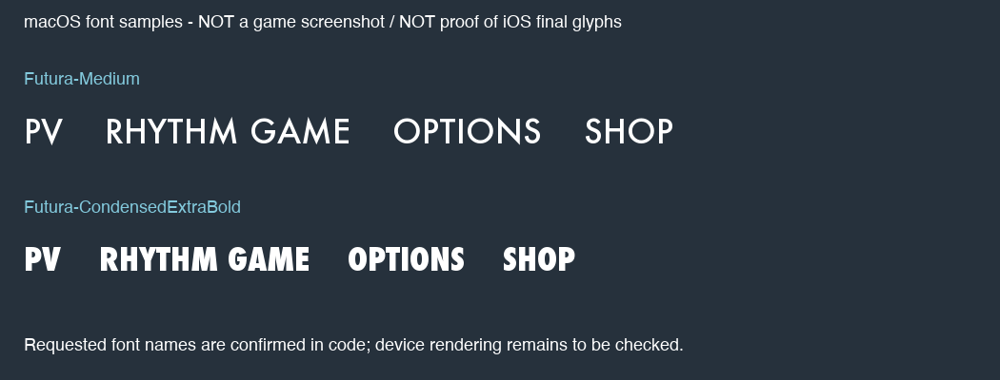

# 英文字体与文字贴图

## 已确认：动态文字请求Futura字体

`TexTextManager::init`（`0x1eeb4`）在`0x1ef38`和`0x1ef4a`两次传入字体枚举`14 / 0x0e`，创建两块动态文字纹理。它们都调用`CloudFontTexture::Create`（`0x58f80`）。

字体表` s_tblFontType / 0x1419cc`每项8字节，保存常规/粗体两个NSString指针。第14项位于`0x141a3c`：

| 选择 | UIFont名称 | NSString地址 | 用途 |
|---|---|---|---|
| 常规 | **Futura-Medium** | `0x146708` | 动态文字的常规字形 |
| Bold | **Futura-CondensedExtraBold** | `0x146718` | 动态文字的粗体字形；它同时是更窄的字形，不能简单视作常规字形加粗 |

创建函数在`0x590ea`/`0x59106`读出这两个指针，在`0x590f6`/`0x5910c`调用`+[UIFont fontWithName:size:]`。`CloudFontTexture::SetText`（`0x59164`）依据Bold参数选择对象的`+0x48`或`+0x4c`字体指针，再使用`drawInRect:withFont:lineBreakMode:alignment:`将文字绘制进纹理。修改字号函数`0x594cc`仍使用同一对名称。

初始字号常数`0x16196c`为24；各窗口还会调用SetFontSize，因此不能说全app只用24号。结尾名单由`WindowEnding / 0x38940`通过TexTextManager绘制，走上述动态文字路径。缺字的替代/回退字形由设备上的UIKit/font系统决定，当前静态样本没有记录实际回退字体。

包内没有`.ttf/.otf/.ttc/.woff`字体文件，Info.plist没有UIAppFonts项。这一对是请求iOS提供的字体名称，无法从这个app包提取出字体文件。[font_mapping.json](data/font_mapping.json)包含指针和完整引擎字体表供复核。

## 不能混同：界面很多文字是PNG

COOL/FINE/SAFE/SAD/WORST、PERFECT、难度按钮、标题Logo以及score/highscore/combonumber字形都在图集中。[game_tex_01切图页](galleries/game_tex_01.md)、[UI_tex_01切图页](galleries/UI_tex_01.md)可逐张看原尺寸。它们的显示不经过UIFont，包里没有保存其制作时的字体名称，不能据动态文字使用Futura就断言所有按钮也由Futura制作。游戏罗马字键盘与歌词字形亦有独立PNG资源。

## 其他字体证据

DebugViewController.nib记录了Helvetica-Bold、.HelveticaNeueInterface-MediumP4、.HelveticaNeueInterface-Regular等UIKit字体；这是调试界面，不能代表正式游戏HUD。Twitter/OAuth原生标签处（`0x86bf4`）调用boldSystemFontOfSize，具体字体由系统版本决定。

引擎的字体名称表还列出Arial、Helvetica、Courier等候选字体。候选表中出现名字只证明引擎支持选择它，不证明游戏实际选择过它；正式动态文字初始化选择的是第14项Futura。

## 标题菜单里的PV：运行时绘字后再渲染纹理

`TouchTitleMenus::Rewrite / 0x6a94c`先设置字号32；放大状态为34（`0x6a974`、`0x6a990`），分支中创建字符串`PV`（`0x6a9e4`引用，`0x6a9e8`调用initWithFormat），并在`0x6ab74`调用TexTextManager的SetText:::::。最后一个Bold参数在调用处为0，因此使用**Futura-Medium**。

该包装函数`0x1f4ec`将字符串、位置、白色及Bold参数交给`SetText:Text:X:Y:Color:Bold:`；最终调用CloudFontTexture绘字。因此PV不是包内预先制作的独立PNG，而是**字符串→UIFont绘制→运行时文字纹理→OpenGL渲染**。同一Rewrite函数里的RHYTHM GAME、OPTIONS、SHOP也用相同方式生成。按钮底框仍来自图集，这是文字与底框的组合。

纯英语本身不能决定绘制方法：PV是动态文字，COOL、FINE、EASY、NORMAL等是预制PNG。汉化PV标题需要处理其代码字符串或渲染路径，单改现有Localizable.strings不一定覆盖这些硬编码菜单文字。

## 用户目测差异与复核边界

用户明确指的是标题菜单PV / RHYTHM GAME，并反馈其看起来与Futura不同。本轮重新导出Rewrite（`0x6a94c`）、Render（`0x6abb4`）、SetText包装（`0x1f4ec`）及SetFontSize（`0x1f79c`），确认文字对象m_Text由SetText返回，Render在`0x6b09a`通过TexTextManager渲染；底框则通过TPManager读取frame54/73/52。此样本的这条路径没有读取预制的PV/RHYTHM GAME文字PNG。

准确结论是：**本版本菜单文字运行时生成纹理，代码请求Futura-Medium**。尚未取得用户设备上的`UIFont.fontName`、字体对象是否为空或最终文字纹理，因此不把请求名称等同于已实机确认的实际字形，也不声称目测差异已被解释。应在设备或可运行的相同版本环境中于`0x590f6`/`0x59512`调用返回后检查字体对象，再捕获文字纹理和标题截图比对；如需通过运行时拦截观察，这是后续验证项，本轮未修改旧设备。

上图仅是本机macOS字体的样张，**不是游戏截图，也不是旧iOS字形的替代证据**。没有复制或发布字体文件。
