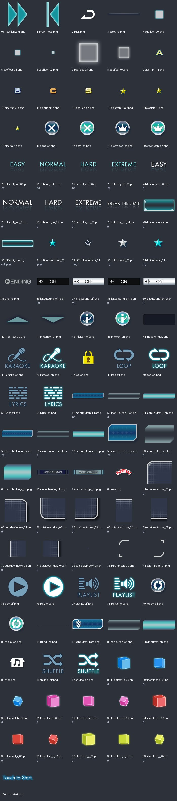
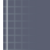
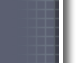
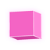
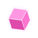

# UI_tex_01：图片与意义

来源：`UI_tex_01.png` + `UI_tex_01.plist`；画布 [1024, 1024]；101个frame。场景：选曲、PV播放控制、通用菜单。

裁切几何来自plist，已确认。用途说明默认按资源名称、图像内容和所属场景解释；只有附有具体函数证据的条目提升为静态确认。on/off一般表示高亮/常态；不保证等于功能启用/禁用。frame序号是程序全局名称表索引，不能当作plist文件里的排列次序。

| 图像（点击看原尺寸） | 名称 / 全局索引 | 意义与证据 | 裁切矩形 x,y,w,h |
|---|---|---|---|
|  | `arrow_forward.png` / 0 | 向前箭头 **名称/图像推断**：plist几何 + frame名称 + 图像内容 | `[495, 0, 169, 214]` |
|  | `arrow_head.png` / 1 | 箭头头部 **名称/图像推断**：plist几何 + frame名称 + 图像内容 | `[665, 83, 120, 218]` |
|  | `back.png` / 2 | 返回标签 **名称/图像推断**：plist几何 + frame名称 + 图像内容 | `[601, 405, 57, 37]` |
|  | `baseline.png` / 3 | 画面底部基线/装饰条 **名称/图像推断**：plist几何 + frame名称 + 图像内容 | `[0, 955, 640, 46]` |
|  | `bgeffect_00.png` / 4 | 界面背景装饰特效；变体 00 **名称/图像推断**：plist几何 + frame名称 + 图像内容 | `[621, 364, 40, 40]` |
|  | `bgeffect_01.png` / 5 | 界面背景装饰特效；变体 01 **名称/图像推断**：plist几何 + frame名称 + 图像内容 | `[990, 33, 28, 28]` |
|  | `bgeffect_02.png` / 6 | 界面背景装饰特效；变体 02 **名称/图像推断**：plist几何 + frame名称 + 图像内容 | `[896, 212, 16, 16]` |
|  | `bgeffect_03.png` / 7 | 界面背景装饰特效；变体 03 **名称/图像推断**：plist几何 + frame名称 + 图像内容 | `[786, 83, 128, 128]` |
|  | `bgeffect_04.png` / 8 | 界面背景装饰特效；变体 04 **名称/图像推断**：plist几何 + frame名称 + 图像内容 | `[364, 657, 64, 64]` |
|  | `clearrank_a.png` / 9 | 选曲界面的A评级/通关标记 **名称/图像推断**：plist几何 + frame名称 + 图像内容 | `[441, 462, 35, 35]` |
|  | `clearrank_b.png` / 10 | 选曲界面的B评级/通关标记 **名称/图像推断**：plist几何 + frame名称 + 图像内容 | `[601, 551, 35, 35]` |
|  | `clearrank_c.png` / 11 | 选曲界面的C评级/通关标记 **名称/图像推断**：plist几何 + frame名称 + 图像内容 | `[601, 515, 35, 35]` |
|  | `clearrank_s.png` / 12 | 选曲界面的S评级/通关标记 **名称/图像推断**：plist几何 + frame名称 + 图像内容 | `[601, 479, 35, 35]` |
|  | `clearrank_star.png` / 13 | 选曲界面的STAR评级/通关标记 **名称/图像推断**：plist几何 + frame名称 + 图像内容 | `[601, 443, 35, 35]` |
|  | `clearstar_l.png` / 14 | 大尺寸通关星 **名称/图像推断**：plist几何 + frame名称 + 图像内容 | `[990, 0, 32, 32]` |
|  | `clearstar_s.png` / 15 | 小尺寸通关星 **名称/图像推断**：plist几何 + frame名称 + 图像内容 | `[990, 62, 24, 24]` |
|  | `close_off.png` / 16 | 关闭；常态/未选中 **名称/图像推断**：plist几何 + frame名称 + 图像内容 | `[851, 605, 67, 67]` |
|  | `close_on.png` / 17 | 关闭；高亮/选中状态 **名称/图像推断**：plist几何 + frame名称 + 图像内容 | `[857, 537, 67, 67]` |
|  | `crownicon_off.png` / 18 | 皇冠标记；常态/未选中 **名称/图像推断**：plist几何 + frame名称 + 图像内容 | `[950, 507, 67, 67]` |
|  | `crownicon_on.png` / 19 | 皇冠标记；高亮/选中状态 **名称/图像推断**：plist几何 + frame名称 + 图像内容 | `[882, 469, 67, 67]` |
|  | `difficulty_off_00.png` / 20 | EASY难度按钮；未选中 **名称/图像推断**：plist几何 + frame名称 + 图像内容 | `[539, 897, 138, 49]` |
|  | `difficulty_off_01.png` / 21 | NORMAL难度按钮；未选中 **名称/图像推断**：plist几何 + frame名称 + 图像内容 | `[400, 886, 138, 49]` |
|  | `difficulty_off_02.png` / 22 | HARD难度按钮；未选中 **名称/图像推断**：plist几何 + frame名称 + 图像内容 | `[851, 955, 138, 49]` |
|  | `difficulty_off_03.png` / 23 | EXTREME难度按钮；未选中 **名称/图像推断**：plist几何 + frame名称 + 图像内容 | `[605, 847, 138, 49]` |
|  | `difficulty_on_00.png` / 24 | EASY难度按钮；选中/高亮 **名称/图像推断**：plist几何 + frame名称 + 图像内容 | `[605, 797, 138, 49]` |
|  | `difficulty_on_01.png` / 25 | NORMAL难度按钮；选中/高亮 **名称/图像推断**：plist几何 + frame名称 + 图像内容 | `[405, 744, 138, 49]` |
|  | `difficulty_on_02.png` / 26 | HARD难度按钮；选中/高亮 **名称/图像推断**：plist几何 + frame名称 + 图像内容 | `[210, 659, 138, 49]` |
|  | `difficulty_on_03.png` / 27 | EXTREME难度按钮；选中/高亮 **名称/图像推断**：plist几何 + frame名称 + 图像内容 | `[869, 755, 138, 49]` |
|  | `difficulty_on_04.png` / 28 | BREAK THE LIMIT难度按钮；选中/高亮 **名称/图像推断**：plist几何 + frame名称 + 图像内容 | `[0, 603, 229, 49]` |
|  | `difficultycursor.png` / 29 | 难度选择光标 **名称/图像推断**：plist几何 + frame名称 + 图像内容 | `[495, 215, 164, 66]` |
|  | `difficultycursor_break.png` / 30 | Break The Limit选择光标 **名称/图像推断**：plist几何 + frame名称 + 图像内容 | `[744, 888, 271, 66]` |
|  | `difficultyemblem_00.png` / 31 | 难度徽章；变体 00 **名称/图像推断**：plist几何 + frame名称 + 图像内容 | `[621, 323, 40, 40]` |
|  | `difficultyemblem_01.png` / 32 | 难度徽章；变体 01 **名称/图像推断**：plist几何 + frame名称 + 图像内容 | `[621, 282, 40, 40]` |
|  | `difficultystar_00.png` / 33 | 难度星形标记；变体 00 **名称/图像推断**：plist几何 + frame名称 + 图像内容 | `[973, 327, 45, 43]` |
|  | `difficultystar_01.png` / 34 | 难度星形标记；变体 01 **名称/图像推断**：plist几何 + frame名称 + 图像内容 | `[973, 283, 45, 43]` |
|  | `ending.png` / 35 | 结尾入口标签 **名称/图像推断**：plist几何 + frame名称 + 图像内容 | `[610, 731, 112, 32]` |
|  | `failedsound_off_b.png` / 36 | 失败时人声音量选项；on/off状态与黑/白(b/w)两种显示版本，精确画面关联待核 **名称/图像推断**：plist几何 + frame名称 + 图像内容 | `[200, 864, 199, 45]` |
|  | `failedsound_off_w.png` / 37 | 失败时人声音量选项；on/off状态与黑/白(b/w)两种显示版本，精确画面关联待核 **名称/图像推断**：plist几何 + frame名称 + 图像内容 | `[0, 864, 199, 45]` |
|  | `failedsound_on_b.png` / 38 | 失败时人声音量选项；on/off状态与黑/白(b/w)两种显示版本，精确画面关联待核 **名称/图像推断**：plist几何 + frame名称 + 图像内容 | `[405, 840, 199, 45]` |
|  | `failedsound_on_w.png` / 39 | 失败时人声音量选项；on/off状态与黑/白(b/w)两种显示版本，精确画面关联待核 **名称/图像推断**：plist几何 + frame名称 + 图像内容 | `[405, 794, 199, 45]` |
|  | `infoarrow_00.png` / 40 | 信息页箭头；变体 00 **名称/图像推断**：plist几何 + frame名称 + 图像内容 | `[429, 691, 116, 52]` |
|  | `infoarrow_01.png` / 41 | 信息页箭头；变体 01 **名称/图像推断**：plist几何 + frame名称 + 图像内容 | `[622, 678, 116, 52]` |
|  | `infoicon_off.png` / 42 | 信息按钮；常态/未选中 **名称/图像推断**：plist几何 + frame名称 + 图像内容 | `[950, 439, 67, 67]` |
|  | `infoicon_on.png` / 43 | 信息按钮；高亮/选中状态 **名称/图像推断**：plist几何 + frame名称 + 图像内容 | `[882, 401, 67, 67]` |
|  | `insidewindow.png` / 44 | 窗口内部填充底图 **名称/图像推断**：plist几何 + frame名称 + 图像内容 | `[0, 0, 494, 177]` |
|  | `karaoke_off.png` / 45 | 卡拉OK/伴奏切换；常态/未选中 **名称/图像推断**：plist几何 + frame名称 + 图像内容 | `[637, 584, 109, 93]` |
|  | `karaoke_on.png` / 46 | 卡拉OK/伴奏切换；高亮/选中状态 **名称/图像推断**：plist几何 + frame名称 + 图像内容 | `[747, 494, 109, 93]` |
|  | `locked.png` / 47 | 未解锁锁头 **名称/图像推断**：plist几何 + frame名称 + 图像内容 | `[979, 225, 45, 57]` |
|  | `loop_off.png` / 48 | PV循环播放模式；常态/未选中 **名称/图像推断**：plist几何 + frame名称 + 图像内容 | `[637, 490, 109, 93]` |
|  | `loop_on.png` / 49 | PV循环播放模式；高亮/选中状态 **名称/图像推断**：plist几何 + frame名称 + 图像内容 | `[491, 459, 109, 93]` |
|  | `lyrics_off.png` / 50 | PV歌词显示；常态/未选中 **名称/图像推断**：plist几何 + frame名称 + 图像内容 | `[381, 368, 109, 93]` |
|  | `lyrics_on.png` / 51 | PV歌词显示；高亮/选中状态 **名称/图像推断**：plist几何 + frame名称 + 图像内容 | `[772, 400, 109, 93]` |
|  | `menubutton_l_base.png` / 52 | 通用菜单按钮底图；变体 l_base **名称/图像推断**：plist几何 + frame名称 + 图像内容 | `[0, 178, 394, 82]` |
|  | `menubutton_l_off.png` / 53 | 通用菜单按钮底图；变体 l_off **名称/图像推断**：plist几何 + frame名称 + 图像内容 | `[0, 330, 380, 68]` |
|  | `menubutton_l_on.png` / 54 | 通用菜单按钮底图；变体 l_on **名称/图像推断**：plist几何 + frame名称 + 图像内容 | `[0, 261, 380, 68]` |
|  | `menubutton_m_base.png` / 55 | 通用菜单按钮底图；变体 m_base **名称/图像推断**：plist几何 + frame名称 + 图像内容 | `[665, 0, 324, 82]` |
|  | `menubutton_m_off.png` / 56 | 通用菜单按钮底图；变体 m_off **名称/图像推断**：plist几何 + frame名称 + 图像内容 | `[0, 468, 310, 68]` |
|  | `menubutton_m_on.png` / 57 | 通用菜单按钮底图；变体 m_on **名称/图像推断**：plist几何 + frame名称 + 图像内容 | `[0, 399, 310, 68]` |
|  | `menubutton_s_base.png` / 58 | 通用菜单按钮底图；变体 s_base **名称/图像推断**：plist几何 + frame名称 + 图像内容 | `[491, 282, 129, 82]` |
|  | `menubutton_s_off.png` / 59 | 通用菜单按钮底图；变体 s_off **名称/图像推断**：plist几何 + frame名称 + 图像内容 | `[441, 622, 115, 68]` |
|  | `menubutton_s_on.png` / 60 | 通用菜单按钮底图；变体 s_on **名称/图像推断**：plist几何 + frame名称 + 图像内容 | `[441, 553, 115, 68]` |
|  | `modechange_off.png` / 61 | 切换模式；常态/未选中 **名称/图像推断**：plist几何 + frame名称 + 图像内容 | `[0, 793, 404, 70]` |
|  | `modechange_on.png` / 62 | 切换模式；高亮/选中状态 **名称/图像推断**：plist几何 + frame名称 + 图像内容 | `[0, 722, 404, 70]` |
|  | `new.png` / 63 | 新增内容标记 **名称/图像推断**：plist几何 + frame名称 + 图像内容 | `[610, 764, 72, 32]` |
|  | `outsidewindow_00.png` / 64 | 通用窗口九宫格部件；变体 00 **名称/图像推断**：plist几何 + frame名称 + 图像内容 | `[925, 575, 99, 89]` |
|  | `outsidewindow_01.png` / 65 | 通用窗口九宫格部件；变体 01 **名称/图像推断**：plist几何 + frame名称 + 图像内容 | `[919, 665, 103, 89]` |
|  | `outsidewindow_02.png` / 66 | 通用窗口九宫格部件；变体 02 **名称/图像推断**：plist几何 + frame名称 + 图像内容 | `[395, 178, 99, 95]` |
|  | `outsidewindow_03.png` / 67 | 通用窗口九宫格部件；变体 03 **名称/图像推断**：plist几何 + frame名称 + 图像内容 | `[747, 588, 103, 95]` |
|  | `outsidewindow_04.png` / 68 | 通用窗口九宫格部件；变体 04 **名称/图像推断**：plist几何 + frame名称 + 图像内容 | `[915, 179, 63, 89]` |
|  | `outsidewindow_05.png` / 69 | 通用窗口九宫格部件；变体 05 **名称/图像推断**：plist几何 + frame名称 + 图像内容 | `[915, 83, 63, 95]` |
|  | `outsidewindow_06.png` / 70 | 通用窗口九宫格部件；变体 06 **名称/图像推断**：plist几何 + frame名称 + 图像内容 | `[546, 717, 63, 63]` |
|  | `outsidewindow_07.png` / 71 | 通用窗口九宫格部件；变体 07 **名称/图像推断**：plist几何 + frame名称 + 图像内容 | `[896, 269, 76, 63]` |
|  | `outsidewindow_08.png` / 72 | 通用窗口九宫格部件；变体 08 **名称/图像推断**：plist几何 + frame名称 + 图像内容 | `[1019, 33, 4, 4]` |
|  | `parenthesis_00.png` / 73 | 括号状装饰；变体 00 **名称/图像推断**：plist几何 + frame名称 + 图像内容 | `[979, 156, 39, 68]` |
|  | `parenthesis_01.png` / 74 | 括号状装饰；变体 01 **名称/图像推断**：plist几何 + frame名称 + 图像内容 | `[979, 87, 39, 68]` |
|  | `play_off.png` / 75 | 播放；常态/未选中 **名称/图像推断**：plist几何 + frame名称 + 图像内容 | `[662, 396, 109, 93]` |
|  | `play_on.png` / 76 | 播放；高亮/选中状态 **名称/图像推断**：plist几何 + frame名称 + 图像内容 | `[772, 306, 109, 93]` |
|  | `playlist_off.png` / 77 | PV播放列表模式；常态/未选中 **名称/图像推断**：plist几何 + frame名称 + 图像内容 | `[491, 365, 109, 93]` |
|  | `playlist_on.png` / 78 | PV播放列表模式；高亮/选中状态 **名称/图像推断**：plist几何 + frame名称 + 图像内容 | `[662, 302, 109, 93]` |
|  | `replay_off.png` / 79 | 圆形双箭头按钮；用户截图对应on态，用户指认随机选曲（资源名replay，实际调用关联另待核）；常态/未选中 **名称/图像推断**：plist几何 + frame名称 + 图像内容 | `[950, 371, 67, 67]` |
|  | `replay_on.png` / 80 | 圆形双箭头按钮；用户截图对应on态，用户指认随机选曲（资源名replay，实际调用关联另待核）；高亮/选中状态 **名称/图像推断**：plist几何 + frame名称 + 图像内容 | `[882, 333, 67, 67]` |
|  | `ruledline.png` / 81 | 分隔横线 **名称/图像推断**：plist几何 + frame名称 + 图像内容 | `[0, 1018, 537, 3]` |
|  | `sgnbutton_base.png` / 82 | 菜单按钮装饰（sgn的缩写含义待核）；底图 **名称/图像推断**：plist几何 + frame名称 + 图像内容 | `[744, 805, 229, 82]` |
|  | `sgnbutton_off.png` / 83 | 菜单按钮装饰（sgn的缩写含义待核）；常态/未选中 **名称/图像推断**：plist几何 + frame名称 + 图像内容 | `[641, 955, 209, 62]` |
|  | `sgnbutton_on.png` / 84 | 菜单按钮装饰（sgn的缩写含义待核）；高亮/选中状态 **名称/图像推断**：plist几何 + frame名称 + 图像内容 | `[0, 659, 209, 62]` |
|  | `shop.png` / 85 | 商店入口文字/图标 **名称/图像推断**：plist几何 + frame名称 + 图像内容 | `[723, 749, 62, 39]` |
|  | `shuffle_off.png` / 86 | PV随机播放模式；常态/未选中 **静态确认**：TouchPVLoopModeUpdate 0x717e0：模式3使用frame 86/87；GotoNextPV 0x29678 | `[381, 274, 109, 93]` |
|  | `shuffle_on.png` / 87 | PV随机播放模式；高亮/选中状态 **静态确认**：TouchPVLoopModeUpdate 0x717e0：模式3使用frame 86/87；GotoNextPV 0x29678 | `[786, 212, 109, 93]` |
|  | `titleeffect_b_00.png` / 88 | 标题彩色方块特效；变体 b_00 **名称/图像推断**：plist几何 + frame名称 + 图像内容 | `[299, 594, 64, 64]` |
|  | `titleeffect_b_01.png` / 89 | 标题彩色方块特效；变体 b_01 **名称/图像推断**：plist几何 + frame名称 + 图像内容 | `[804, 738, 64, 64]` |
|  | `titleeffect_b_02.png` / 90 | 标题彩色方块特效；变体 b_02 **名称/图像推断**：plist几何 + frame名称 + 图像内容 | `[739, 684, 64, 64]` |
|  | `titleeffect_p_00.png` / 91 | 标题彩色方块特效；变体 p_00 **名称/图像推断**：plist几何 + frame名称 + 图像内容 | `[557, 652, 64, 64]` |
|  | `titleeffect_p_01.png` / 92 | 标题彩色方块特效；变体 p_01 **名称/图像推断**：plist几何 + frame名称 + 图像内容 | `[376, 592, 64, 64]` |
|  | `titleeffect_p_02.png` / 93 | 标题彩色方块特效；变体 p_02 **名称/图像推断**：plist几何 + frame名称 + 图像内容 | `[311, 529, 64, 64]` |
|  | `titleeffect_r_00.png` / 94 | 标题彩色方块特效；变体 r_00 **名称/图像推断**：plist几何 + frame名称 + 图像内容 | `[557, 587, 64, 64]` |
|  | `titleeffect_r_01.png` / 95 | 标题彩色方块特效；变体 r_01 **名称/图像推断**：plist几何 + frame名称 + 图像内容 | `[376, 527, 64, 64]` |
|  | `titleeffect_r_02.png` / 96 | 标题彩色方块特效；变体 r_02 **名称/图像推断**：plist几何 + frame名称 + 图像内容 | `[311, 464, 64, 64]` |
|  | `titleeffect_y_00.png` / 97 | 标题彩色方块特效；变体 y_00 **名称/图像推断**：plist几何 + frame名称 + 图像内容 | `[376, 462, 64, 64]` |
|  | `titleeffect_y_01.png` / 98 | 标题彩色方块特效；变体 y_01 **名称/图像推断**：plist几何 + frame名称 + 图像内容 | `[311, 399, 64, 64]` |
|  | `titleeffect_y_02.png` / 99 | 标题彩色方块特效；变体 y_02 **名称/图像推断**：plist几何 + frame名称 + 图像内容 | `[851, 673, 64, 64]` |
|  | `touchstart.png` / 100 | 触摸开始提示文字 **名称/图像推断**：plist几何 + frame名称 + 图像内容 | `[0, 537, 298, 65]` |
