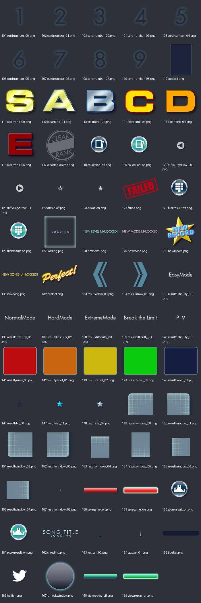
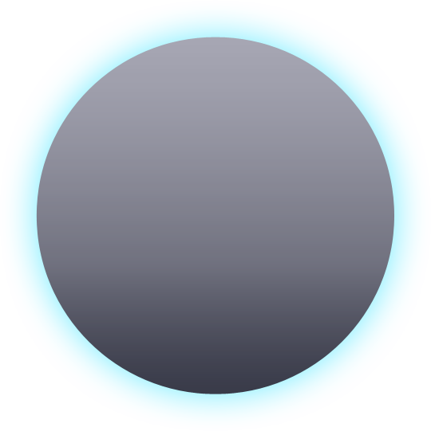

# UI_tex_02：图片与意义

来源：`UI_tex_02.png` + `UI_tex_02.plist`；画布 [1024, 1024]；69个frame。场景：结果、解锁、收藏与载入。

裁切几何来自plist，已确认。用途说明默认按资源名称、图像内容和所属场景解释；只有附有具体函数证据的条目提升为静态确认。on/off一般表示高亮/常态；不保证等于功能启用/禁用。frame序号是程序全局名称表索引，不能当作plist文件里的排列次序。

| 图像（点击看原尺寸） | 名称 / 全局索引 | 意义与证据 | 裁切矩形 x,y,w,h |
|---|---|---|---|
|  | `cardnumber_00.png` / 101 | 收藏卡片编号字形00；编号与实际收藏项目关系待核 **名称/图像推断**：plist几何 + frame名称 + 图像内容 | `[836, 840, 63, 78]` |
|  | `cardnumber_01.png` / 102 | 收藏卡片编号字形01；编号与实际收藏项目关系待核 **名称/图像推断**：plist几何 + frame名称 + 图像内容 | `[922, 772, 63, 78]` |
|  | `cardnumber_02.png` / 103 | 收藏卡片编号字形02；编号与实际收藏项目关系待核 **名称/图像推断**：plist几何 + frame名称 + 图像内容 | `[918, 693, 63, 78]` |
|  | `cardnumber_03.png` / 104 | 收藏卡片编号字形03；编号与实际收藏项目关系待核 **名称/图像推断**：plist几何 + frame名称 + 图像内容 | `[854, 693, 63, 78]` |
|  | `cardnumber_04.png` / 105 | 收藏卡片编号字形04；编号与实际收藏项目关系待核 **名称/图像推断**：plist几何 + frame名称 + 图像内容 | `[772, 946, 63, 78]` |
|  | `cardnumber_05.png` / 106 | 收藏卡片编号字形05；编号与实际收藏项目关系待核 **名称/图像推断**：plist几何 + frame名称 + 图像内容 | `[772, 867, 63, 78]` |
|  | `cardnumber_06.png` / 107 | 收藏卡片编号字形06；编号与实际收藏项目关系待核 **名称/图像推断**：plist几何 + frame名称 + 图像内容 | `[708, 946, 63, 78]` |
|  | `cardnumber_07.png` / 108 | 收藏卡片编号字形07；编号与实际收藏项目关系待核 **名称/图像推断**：plist几何 + frame名称 + 图像内容 | `[708, 867, 63, 78]` |
|  | `cardnumber_08.png` / 109 | 收藏卡片编号字形08；编号与实际收藏项目关系待核 **名称/图像推断**：plist几何 + frame名称 + 图像内容 | `[644, 875, 63, 78]` |
|  | `cardslot.png` / 110 | 收藏卡片槽 **名称/图像推断**：plist几何 + frame名称 + 图像内容 | `[798, 224, 103, 153]` |
|  | `clearrank_00.png` / 111 | S评级大字贴图 **名称/图像推断**：plist几何 + frame名称 + 图像内容 | `[710, 559, 145, 107]` |
|  | `clearrank_01.png` / 112 | A评级大字贴图 **名称/图像推断**：plist几何 + frame名称 + 图像内容 | `[445, 882, 145, 107]` |
|  | `clearrank_02.png` / 113 | B评级大字贴图 **名称/图像推断**：plist几何 + frame名称 + 图像内容 | `[380, 744, 145, 107]` |
|  | `clearrank_03.png` / 114 | C评级大字贴图 **名称/图像推断**：plist几何 + frame名称 + 图像内容 | `[362, 636, 145, 107]` |
|  | `clearrank_04.png` / 115 | D评级大字贴图 **名称/图像推断**：plist几何 + frame名称 + 图像内容 | `[299, 883, 145, 107]` |
|  | `clearrank_05.png` / 116 | E评级大字贴图 **名称/图像推断**：plist几何 + frame名称 + 图像内容 | `[153, 883, 145, 107]` |
|  | `clearrankstamp.png` / 117 | 结果评级的印章/底饰 **名称/图像推断**：plist几何 + frame名称 + 图像内容 | `[0, 636, 210, 235]` |
|  | `collection_off.png` / 118 | 收藏/收集界面；常态/未选中 **名称/图像推断**：plist几何 + frame名称 + 图像内容 | `[854, 772, 67, 67]` |
|  | `collection_on.png` / 119 | 收藏/收集界面；高亮/选中状态 **名称/图像推断**：plist几何 + frame名称 + 图像内容 | `[786, 731, 67, 67]` |
|  | `difficultyarrow_00.png` / 120 | 难度切换箭头；变体 00 **名称/图像推断**：plist几何 + frame名称 + 图像内容 | `[799, 667, 30, 30]` |
|  | `difficultyarrow_01.png` / 121 | 难度切换箭头；变体 01 **名称/图像推断**：plist几何 + frame名称 + 图像内容 | `[902, 327, 30, 30]` |
|  | `drstar_off.png` / 122 | 结果界面的星形标记（dr缩写待核）；常态/未选中 **名称/图像推断**：plist几何 + frame名称 + 图像内容 | `[933, 355, 22, 22]` |
|  | `drstar_on.png` / 123 | 结果界面的星形标记（dr缩写待核）；高亮/选中状态 **名称/图像推断**：plist几何 + frame名称 + 图像内容 | `[915, 80, 22, 22]` |
|  | `failed.png` / 124 | 失败提示文字 **名称/图像推断**：plist几何 + frame名称 + 图像内容 | `[541, 224, 256, 160]` |
|  | `flickresult_off.png` / 125 | 滑动输入结果页切换；常态/未选中 **名称/图像推断**：plist几何 + frame名称 + 图像内容 | `[764, 799, 67, 67]` |
|  | `flickresult_on.png` / 126 | 滑动输入结果页切换；高亮/选中状态 **名称/图像推断**：plist几何 + frame名称 + 图像内容 | `[696, 799, 67, 67]` |
|  | `loading.png` / 127 | LOADING文字贴图 **名称/图像推断**：plist几何 + frame名称 + 图像内容 | `[211, 636, 150, 150]` |
|  | `newlevel.png` / 128 | 新难度解锁提示 **名称/图像推断**：plist几何 + frame名称 + 图像内容 | `[541, 40, 409, 39]` |
|  | `newmode.png` / 129 | 新模式解锁提示 **名称/图像推断**：plist几何 + frame名称 + 图像内容 | `[0, 596, 409, 39]` |
|  | `newrecord.png` / 130 | 新纪录提示 **名称/图像推断**：plist几何 + frame名称 + 图像内容 | `[0, 872, 152, 152]` |
|  | `newsong.png` / 131 | 新歌曲解锁提示 **名称/图像推断**：plist几何 + frame名称 + 图像内容 | `[541, 0, 409, 39]` |
|  | `perfect.png` / 132 | PERFECT文字贴图 **名称/图像推断**：plist几何 + frame名称 + 图像内容 | `[211, 787, 168, 95]` |
|  | `resultarrow_00.png` / 133 | 结果页切换箭头；变体 00 **名称/图像推断**：plist几何 + frame名称 + 图像内容 | `[591, 875, 52, 88]` |
|  | `resultarrow_01.png` / 134 | 结果页切换箭头；变体 01 **名称/图像推断**：plist几何 + frame名称 + 图像内容 | `[651, 589, 52, 88]` |
|  | `resultdifficulty_00.png` / 135 | 结果界面难度标记第00项；与难度枚举对应需按调用核对 **名称/图像推断**：plist几何 + frame名称 + 图像内容 | `[545, 559, 164, 29]` |
|  | `resultdifficulty_01.png` / 136 | 结果界面难度标记第01项；与难度枚举对应需按调用核对 **名称/图像推断**：plist几何 + frame名称 + 图像内容 | `[380, 852, 164, 29]` |
|  | `resultdifficulty_02.png` / 137 | 结果界面难度标记第02项；与难度枚举对应需按调用核对 **名称/图像推断**：plist几何 + frame名称 + 图像内容 | `[318, 991, 164, 29]` |
|  | `resultdifficulty_03.png` / 138 | 结果界面难度标记第03项；与难度枚举对应需按调用核对 **名称/图像推断**：plist几何 + frame名称 + 图像内容 | `[706, 529, 164, 29]` |
|  | `resultdifficulty_04.png` / 139 | 结果界面难度标记第04项；与难度枚举对应需按调用核对 **名称/图像推断**：plist几何 + frame名称 + 图像内容 | `[541, 529, 164, 29]` |
|  | `resultdifficulty_05.png` / 140 | 结果界面难度标记第05项；与难度枚举对应需按调用核对 **名称/图像推断**：plist几何 + frame名称 + 图像内容 | `[153, 991, 164, 29]` |
|  | `resultpanel_00.png` / 141 | 结果信息面板底图；变体 00 **名称/图像推断**：plist几何 + frame名称 + 图像内容 | `[526, 694, 123, 104]` |
|  | `resultpanel_01.png` / 142 | 结果信息面板底图；变体 01 **名称/图像推断**：plist几何 + frame名称 + 图像内容 | `[527, 589, 123, 104]` |
|  | `resultpanel_02.png` / 143 | 结果信息面板底图；变体 02 **名称/图像推断**：plist几何 + frame名称 + 图像内容 | `[856, 588, 123, 104]` |
|  | `resultpanel_03.png` / 144 | 结果信息面板底图；变体 03 **名称/图像推断**：plist几何 + frame名称 + 图像内容 | `[871, 483, 123, 104]` |
|  | `resultpanel_04.png` / 145 | 结果信息面板底图；变体 04 **名称/图像推断**：plist几何 + frame名称 + 图像内容 | `[858, 378, 123, 104]` |
|  | `resultstat_00.png` / 146 | 结果统计项目标签；变体 00 **名称/图像推断**：plist几何 + frame名称 + 图像内容 | `[799, 698, 28, 27]` |
|  | `resultstat_01.png` / 147 | 结果统计项目标签；变体 01 **名称/图像推断**：plist几何 + frame名称 + 图像内容 | `[933, 327, 28, 27]` |
|  | `resultstat_02.png` / 148 | 结果统计项目标签；变体 02 **名称/图像推断**：plist几何 + frame名称 + 图像内容 | `[836, 919, 28, 27]` |
|  | `resultwindow_00.png` / 149 | 结果窗口九宫格部件；变体 00 **名称/图像推断**：plist几何 + frame名称 + 图像内容 | `[545, 799, 86, 75]` |
|  | `resultwindow_01.png` / 150 | 结果窗口九宫格部件；变体 01 **名称/图像推断**：plist几何 + frame名称 + 图像内容 | `[432, 542, 94, 75]` |
|  | `resultwindow_02.png` / 151 | 结果窗口九宫格部件；变体 02 **名称/图像推断**：plist几何 + frame名称 + 图像内容 | `[902, 224, 86, 102]` |
|  | `resultwindow_03.png` / 152 | 结果窗口九宫格部件；变体 03 **名称/图像推断**：plist几何 + frame名称 + 图像内容 | `[915, 103, 94, 102]` |
|  | `resultwindow_04.png` / 153 | 结果窗口九宫格部件；变体 04 **名称/图像推断**：plist几何 + frame名称 + 图像内容 | `[632, 799, 63, 75]` |
|  | `resultwindow_05.png` / 154 | 结果窗口九宫格部件；变体 05 **名称/图像推断**：plist几何 + frame名称 + 图像内容 | `[951, 0, 63, 102]` |
|  | `resultwindow_06.png` / 155 | 结果窗口九宫格部件；变体 06 **名称/图像推断**：plist几何 + frame名称 + 图像内容 | `[644, 954, 63, 63]` |
|  | `resultwindow_07.png` / 156 | 结果窗口九宫格部件；变体 07 **名称/图像推断**：plist几何 + frame名称 + 图像内容 | `[704, 667, 94, 63]` |
|  | `resultwindow_08.png` / 157 | 结果窗口九宫格部件；变体 08 **名称/图像推断**：plist几何 + frame名称 + 图像内容 | `[799, 726, 4, 4]` |
|  | `savegame_off.png` / 158 | 保存游戏/重播数据；常态/未选中 **名称/图像推断**：plist几何 + frame名称 + 图像内容 | `[541, 457, 316, 71]` |
|  | `savegame_on.png` / 159 | 保存游戏/重播数据；高亮/选中状态 **名称/图像推断**：plist几何 + frame名称 + 图像内容 | `[541, 385, 316, 71]` |
|  | `scoreresult_off.png` / 160 | 得分结果页切换；常态/未选中 **名称/图像推断**：plist几何 + frame名称 + 图像内容 | `[718, 731, 67, 67]` |
|  | `scoreresult_on.png` / 161 | 得分结果页切换；高亮/选中状态 **名称/图像推断**：plist几何 + frame名称 + 图像内容 | `[650, 731, 67, 67]` |
|  | `stloading.png` / 162 | 载入提示小标签 **名称/图像推断**：plist几何 + frame名称 + 图像内容 | `[483, 990, 148, 34]` |
|  | `textbar_00.png` / 163 | 结果页文字底条；变体 00 **名称/图像推断**：plist几何 + frame名称 + 图像内容 | `[410, 596, 4, 23]` |
|  | `textbar_01.png` / 164 | 结果页文字底条；变体 01 **名称/图像推断**：plist几何 + frame名称 + 图像内容 | `[362, 744, 4, 23]` |
|  | `titlebar.png` / 165 | 标题栏底图 **名称/图像推断**：plist几何 + frame名称 + 图像内容 | `[0, 542, 431, 53]` |
|  | `twitter.png` / 166 | Twitter分享标记 **名称/图像推断**：plist几何 + frame名称 + 图像内容 | `[651, 678, 52, 44]` |
|  | `unlockwindow.png` / 167 | 解锁通知窗口 **名称/图像推断**：plist几何 + frame名称 + 图像内容 | `[0, 0, 540, 541]` |
|  | `viewreplay_off.png` / 168 | 观看重播；常态/未选中 **名称/图像推断**：plist几何 + frame名称 + 图像内容 | `[541, 152, 373, 71]` |
|  | `viewreplay_on.png` / 169 | 观看重播；高亮/选中状态 **名称/图像推断**：plist几何 + frame名称 + 图像内容 | `[541, 80, 373, 71]` |
