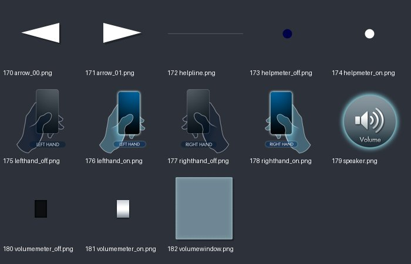
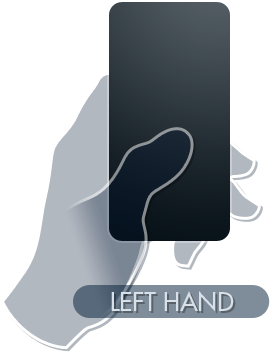
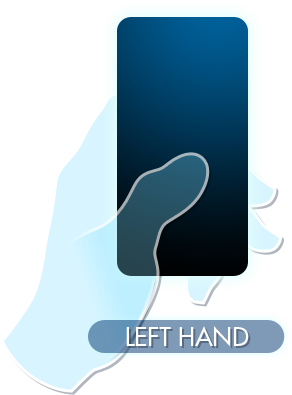
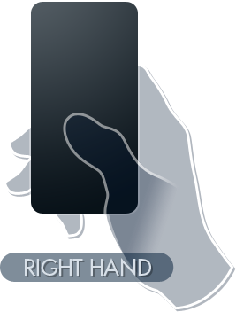
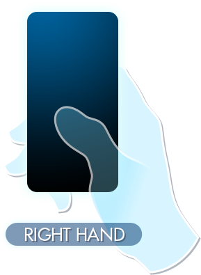
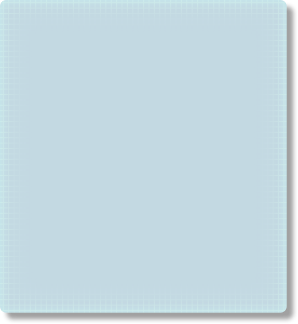

# UI_tex_03：图片与意义

来源：`UI_tex_03.png` + `UI_tex_03.plist`；画布 [1024, 1024]；13个frame。场景：音量、帮助、左右手设置。

裁切几何来自plist，已确认。用途说明默认按资源名称、图像内容和所属场景解释；只有附有具体函数证据的条目提升为静态确认。on/off一般表示高亮/常态；不保证等于功能启用/禁用。frame序号是程序全局名称表索引，不能当作plist文件里的排列次序。

| 图像（点击看原尺寸） | 名称 / 全局索引 | 意义与证据 | 裁切矩形 x,y,w,h |
|---|---|---|---|
|  | `arrow_00.png` / 170 | 设置页箭头；变体 00 **名称/图像推断**：plist几何 + frame名称 + 图像内容 | `[934, 38, 68, 37]` |
|  | `arrow_01.png` / 171 | 设置页箭头；变体 01 **名称/图像推断**：plist几何 + frame名称 + 图像内容 | `[934, 0, 68, 37]` |
|  | `helpline.png` / 172 | 帮助指引线 **名称/图像推断**：plist几何 + frame名称 + 图像内容 | `[0, 0, 640, 12]` |
|  | `helpmeter_off.png` / 173 | 帮助/提示量表选项；常态/未选中 **名称/图像推断**：plist几何 + frame名称 + 图像内容 | `[1003, 18, 17, 17]` |
|  | `helpmeter_on.png` / 174 | 帮助/提示量表选项；高亮/选中状态 **名称/图像推断**：plist几何 + frame名称 + 图像内容 | `[1003, 0, 17, 17]` |
|  | `lefthand_off.png` / 175 | 左手模式；常态/未选中 **名称/图像推断**：plist几何 + frame名称 + 图像内容 | `[0, 13, 270, 352]` |
|  | `lefthand_on.png` / 176 | 左手模式；高亮/选中状态 **名称/图像推断**：plist几何 + frame名称 + 图像内容 | `[641, 0, 292, 395]` |
|  | `righthand_off.png` / 177 | 右手模式；常态/未选中 **名称/图像推断**：plist几何 + frame名称 + 图像内容 | `[271, 13, 267, 352]` |
|  | `righthand_on.png` / 178 | 右手模式；高亮/选中状态 **名称/图像推断**：plist几何 + frame名称 + 图像内容 | `[498, 396, 289, 395]` |
|  | `speaker.png` / 179 | 扬声器图标 **名称/图像推断**：plist几何 + frame名称 + 图像内容 | `[788, 396, 234, 234]` |
|  | `volumemeter_off.png` / 180 | 音量调节量表；常态/未选中 **名称/图像推断**：plist几何 + frame名称 + 图像内容 | `[960, 76, 25, 34]` |
|  | `volumemeter_on.png` / 181 | 音量调节量表；高亮/选中状态 **名称/图像推断**：plist几何 + frame名称 + 图像内容 | `[934, 76, 25, 34]` |
|  | `volumewindow.png` / 182 | 音量设置窗口 **名称/图像推断**：plist几何 + frame名称 + 图像内容 | `[0, 396, 497, 540]` |
