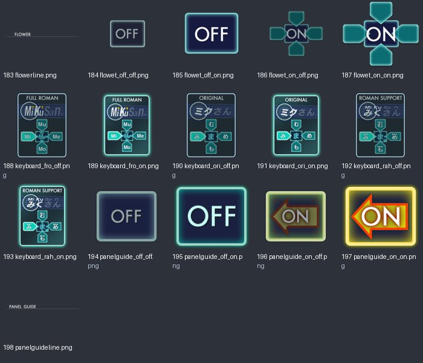
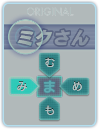
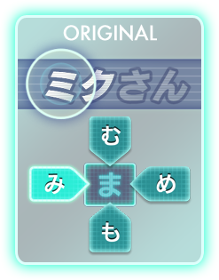
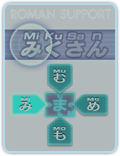

# UI_tex_04：图片与意义

来源：`UI_tex_04.png` + `UI_tex_04.plist`；画布 [1024, 1024]；16个frame。场景：键盘、花形提示与面板引导设置。

裁切几何来自plist，已确认。用途说明默认按资源名称、图像内容和所属场景解释；只有附有具体函数证据的条目提升为静态确认。on/off一般表示高亮/常态；不保证等于功能启用/禁用。frame序号是程序全局名称表索引，不能当作plist文件里的排列次序。

| 图像（点击看原尺寸） | 名称 / 全局索引 | 意义与证据 | 裁切矩形 x,y,w,h |
|---|---|---|---|
|  | `flowerline.png` / 183 | 花形提示选项分隔线 **名称/图像推断**：plist几何 + frame名称 + 图像内容 | `[0, 33, 579, 32]` |
|  | `flowet_off_off.png` / 184 | 花形提示开/关选项（资源名为flowet）；第一个on/off为选项值，第二个为按钮显示状态 **名称/图像推断**：plist几何 + frame名称 + 图像内容 | `[0, 828, 170, 145]` |
|  | `flowet_off_on.png` / 185 | 花形提示开/关选项（资源名为flowet）；第一个on/off为选项值，第二个为按钮显示状态 **名称/图像推断**：plist几何 + frame名称 + 图像内容 | `[342, 322, 170, 145]` |
|  | `flowet_on_off.png` / 186 | 花形提示开/关选项（资源名为flowet）；第一个on/off为选项值，第二个为按钮显示状态 **名称/图像推断**：plist几何 + frame名称 + 图像内容 | `[171, 316, 170, 145]` |
|  | `flowet_on_on.png` / 187 | 花形提示开/关选项（资源名为flowet）；第一个on/off为选项值，第二个为按钮显示状态 **名称/图像推断**：plist几何 + frame名称 + 图像内容 | `[0, 316, 170, 145]` |
|  | `keyboard_fro_off.png` / 188 | 全罗马字键盘设置选项；未选中 **名称/图像推断**：plist几何 + frame名称 + 图像内容 | `[342, 66, 196, 255]` |
|  | `keyboard_fro_on.png` / 189 | 全罗马字键盘设置选项；选中 **名称/图像推断**：plist几何 + frame名称 + 图像内容 | `[539, 316, 247, 315]` |
|  | `keyboard_ori_off.png` / 190 | 原始假名键盘设置选项；未选中 **名称/图像推断**：plist几何 + frame名称 + 图像内容 | `[828, 256, 196, 255]` |
|  | `keyboard_ori_on.png` / 191 | 原始假名键盘设置选项；选中 **名称/图像推断**：plist几何 + frame名称 + 图像内容 | `[0, 512, 247, 315]` |
|  | `keyboard_rah_off.png` / 192 | 罗马字+假名键盘设置选项；未选中 **名称/图像推断**：plist几何 + frame名称 + 图像内容 | `[828, 0, 196, 255]` |
|  | `keyboard_rah_on.png` / 193 | 罗马字+假名键盘设置选项；选中 **名称/图像推断**：plist几何 + frame名称 + 图像内容 | `[580, 0, 247, 315]` |
|  | `panelguide_off_off.png` / 194 | 面板引导开/关选项；第一个on/off为选项值，第二个为按钮显示状态 **名称/图像推断**：plist几何 + frame名称 + 图像内容 | `[248, 468, 129, 110]` |
|  | `panelguide_off_on.png` / 195 | 面板引导开/关选项；第一个on/off为选项值，第二个为按钮显示状态 **名称/图像推断**：plist几何 + frame名称 + 图像内容 | `[378, 468, 129, 110]` |
|  | `panelguide_on_off.png` / 196 | 面板引导开/关选项；第一个on/off为选项值，第二个为按钮显示状态 **名称/图像推断**：plist几何 + frame名称 + 图像内容 | `[248, 632, 129, 110]` |
|  | `panelguide_on_on.png` / 197 | 面板引导开/关选项；第一个on/off为选项值，第二个为按钮显示状态 **名称/图像推断**：plist几何 + frame名称 + 图像内容 | `[171, 828, 129, 110]` |
|  | `panelguideline.png` / 198 | 面板引导选项分隔线 **名称/图像推断**：plist几何 + frame名称 + 图像内容 | `[0, 0, 579, 32]` |
