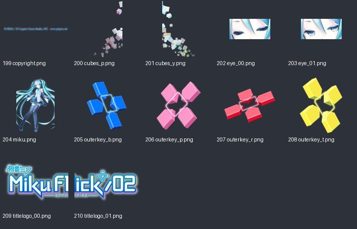

# UI_tex_05：图片与意义

来源：`UI_tex_05.png` + `UI_tex_05.plist`；画布 [1024, 1024]；12个frame。场景：标题画面。

裁切几何来自plist，已确认。用途说明默认按资源名称、图像内容和所属场景解释；只有附有具体函数证据的条目提升为静态确认。on/off一般表示高亮/常态；不保证等于功能启用/禁用。frame序号是程序全局名称表索引，不能当作plist文件里的排列次序。

| 图像（点击看原尺寸） | 名称 / 全局索引 | 意义与证据 | 裁切矩形 x,y,w,h |
|---|---|---|---|
|  | `copyright.png` / 199 | 标题画面的版权文字贴图 **名称/图像推断**：plist几何 + frame名称 + 图像内容 | `[162, 966, 446, 35]` |
|  | `cubes_p.png` / 200 | 标题背景方块；变体 p **名称/图像推断**：plist几何 + frame名称 + 图像内容 | `[856, 380, 168, 302]` |
|  | `cubes_y.png` / 201 | 标题背景方块；变体 y **名称/图像推断**：plist几何 + frame名称 + 图像内容 | `[661, 380, 194, 335]` |
|  | `eye_00.png` / 202 | 标题角色眼部动画帧；变体 00 **名称/图像推断**：plist几何 + frame名称 + 图像内容 | `[81, 966, 80, 40]` |
|  | `eye_01.png` / 203 | 标题角色眼部动画帧；变体 01 **名称/图像推断**：plist几何 + frame名称 + 图像内容 | `[0, 966, 80, 40]` |
|  | `miku.png` / 204 | 标题画面的初音角色图 **名称/图像推断**：plist几何 + frame名称 + 图像内容 | `[0, 0, 660, 965]` |
|  | `outerkey_b.png` / 205 | 标题外围彩色键块；变体 b **名称/图像推断**：plist几何 + frame名称 + 图像内容 | `[661, 843, 79, 95]` |
|  | `outerkey_p.png` / 206 | 标题外围彩色键块；变体 p **名称/图像推断**：plist几何 + frame名称 + 图像内容 | `[759, 716, 88, 97]` |
|  | `outerkey_r.png` / 207 | 标题外围彩色键块；变体 r **名称/图像推断**：plist几何 + frame名称 + 图像内容 | `[856, 683, 101, 67]` |
|  | `outerkey_t.png` / 208 | 标题外围彩色键块；变体 t **名称/图像推断**：plist几何 + frame名称 + 图像内容 | `[661, 716, 97, 126]` |
|  | `titlelogo_00.png` / 209 | Miku Flick/02标题Logo分块；变体 00 **名称/图像推断**：plist几何 + frame名称 + 图像内容 | `[661, 0, 308, 189]` |
|  | `titlelogo_01.png` / 210 | Miku Flick/02标题Logo分块；变体 01 **名称/图像推断**：plist几何 + frame名称 + 图像内容 | `[661, 190, 307, 189]` |
