# UI_tex_06：图片与意义

来源：`UI_tex_06.png` + `UI_tex_06.plist`；画布 [1024, 1024]；39个frame。场景：商店、购买与已安装内容管理。

裁切几何来自plist，已确认。用途说明默认按资源名称、图像内容和所属场景解释；只有附有具体函数证据的条目提升为静态确认。on/off一般表示高亮/常态；不保证等于功能启用/禁用。frame序号是程序全局名称表索引，不能当作plist文件里的排列次序。

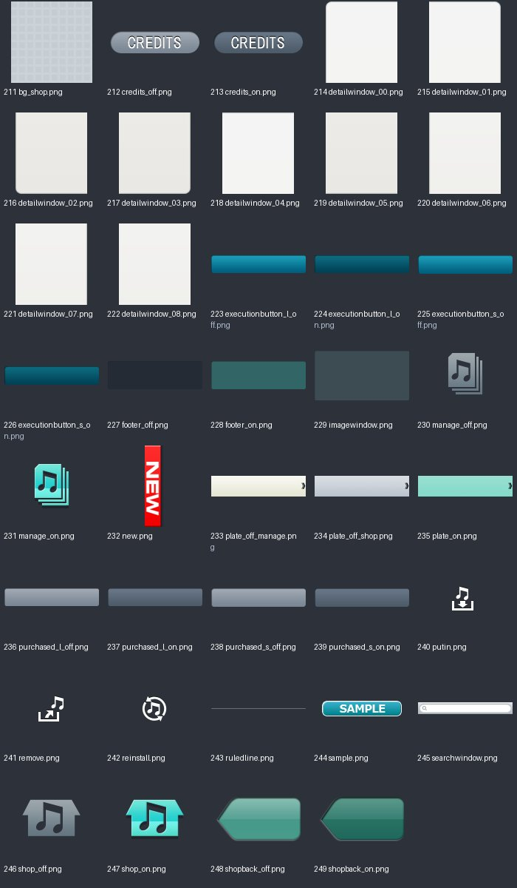

| 图像（点击看原尺寸） | 名称 / 全局索引 | 意义与证据 | 裁切矩形 x,y,w,h |
|---|---|---|---|
| [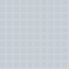](../sprites/UI_tex_06/bg_shop.png) | `bg_shop.png` / 211 | 商店背景 **名称/图像推断**：plist几何 + frame名称 + 图像内容 | `[858, 390, 140, 140]` |
|  | `credits_off.png` / 212 | 版权/制作名单入口；常态/未选中 **名称/图像推断**：plist几何 + frame名称 + 图像内容 | `[122, 965, 121, 30]` |
|  | `credits_on.png` / 213 | 版权/制作名单入口；高亮/选中状态 **名称/图像推断**：plist几何 + frame名称 + 图像内容 | `[0, 965, 121, 30]` |
| [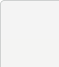](../sprites/UI_tex_06/detailwindow_00.png) | `detailwindow_00.png` / 214 | 详情窗口九宫格部件；变体 00 **名称/图像推断**：plist几何 + frame名称 + 图像内容 | `[719, 671, 123, 139]` |
| [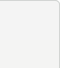](../sprites/UI_tex_06/detailwindow_01.png) | `detailwindow_01.png` / 215 | 详情窗口九宫格部件；变体 01 **名称/图像推断**：plist几何 + frame名称 + 图像内容 | `[620, 811, 123, 139]` |
| [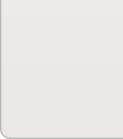](../sprites/UI_tex_06/detailwindow_02.png) | `detailwindow_02.png` / 216 | 详情窗口九宫格部件；变体 02 **名称/图像推断**：plist几何 + frame名称 + 图像内容 | `[595, 671, 123, 139]` |
| [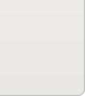](../sprites/UI_tex_06/detailwindow_03.png) | `detailwindow_03.png` / 217 | 详情窗口九宫格部件；变体 03 **名称/图像推断**：plist几何 + frame名称 + 图像内容 | `[812, 531, 123, 139]` |
| [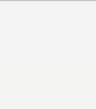](../sprites/UI_tex_06/detailwindow_04.png) | `detailwindow_04.png` / 218 | 详情窗口九宫格部件；变体 04 **名称/图像推断**：plist几何 + frame名称 + 图像内容 | `[496, 825, 123, 139]` |
| [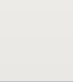](../sprites/UI_tex_06/detailwindow_05.png) | `detailwindow_05.png` / 219 | 详情窗口九宫格部件；变体 05 **名称/图像推断**：plist几何 + frame名称 + 图像内容 | `[372, 825, 123, 139]` |
| [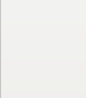](../sprites/UI_tex_06/detailwindow_06.png) | `detailwindow_06.png` / 220 | 详情窗口九宫格部件；变体 06 **名称/图像推断**：plist几何 + frame名称 + 图像内容 | `[248, 825, 123, 139]` |
| [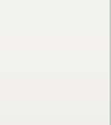](../sprites/UI_tex_06/detailwindow_07.png) | `detailwindow_07.png` / 221 | 详情窗口九宫格部件；变体 07 **名称/图像推断**：plist几何 + frame名称 + 图像内容 | `[124, 825, 123, 139]` |
| [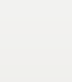](../sprites/UI_tex_06/detailwindow_08.png) | `detailwindow_08.png` / 222 | 详情窗口九宫格部件；变体 08 **名称/图像推断**：plist几何 + frame名称 + 图像内容 | `[0, 825, 123, 139]` |
|  | `executionbutton_l_off.png` / 223 | 商店执行操作按钮底图；变体 l_off **名称/图像推断**：plist几何 + frame名称 + 图像内容 | `[641, 337, 278, 52]` |
|  | `executionbutton_l_on.png` / 224 | 商店执行操作按钮底图；变体 l_on **名称/图像推断**：plist几何 + frame名称 + 图像内容 | `[641, 284, 278, 52]` |
|  | `executionbutton_s_off.png` / 225 | 商店执行操作按钮底图；变体 s_off **名称/图像推断**：plist几何 + frame名称 + 图像内容 | `[595, 522, 216, 43]` |
|  | `executionbutton_s_on.png` / 226 | 商店执行操作按钮底图；变体 s_on **名称/图像推断**：plist几何 + frame名称 + 图像内容 | `[641, 478, 216, 43]` |
|  | `footer_off.png` / 227 | 商店底栏；常态/未选中 **名称/图像推断**：plist几何 + frame名称 + 图像内容 | `[641, 89, 297, 88]` |
|  | `footer_on.png` / 228 | 商店底栏；高亮/选中状态 **名称/图像推断**：plist几何 + frame名称 + 图像内容 | `[641, 0, 297, 88]` |
|  | `imagewindow.png` / 229 | 商店详情图片区域底框 **名称/图像推断**：plist几何 + frame名称 + 图像内容 | `[0, 512, 594, 312]` |
|  | `manage_off.png` / 230 | 附加内容管理；常态/未选中 **名称/图像推断**：plist几何 + frame名称 + 图像内容 | `[939, 171, 48, 60]` |
|  | `manage_on.png` / 231 | 附加内容管理；高亮/选中状态 **名称/图像推断**：plist几何 + frame名称 + 图像内容 | `[939, 110, 48, 60]` |
|  | `new.png` / 232 | 新增内容标记 **名称/图像推断**：plist几何 + frame名称 + 图像内容 | `[988, 221, 34, 140]` |
|  | `plate_off_manage.png` / 233 | 商店顶部选择底板；常态/未选中 **名称/图像推断**：plist几何 + frame名称 + 图像内容 | `[0, 282, 640, 140]` |
| [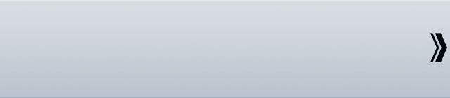](../sprites/UI_tex_06/plate_off_shop.png) | `plate_off_shop.png` / 234 | 商店顶部选择底板；常态/未选中 **名称/图像推断**：plist几何 + frame名称 + 图像内容 | `[0, 141, 640, 140]` |
|  | `plate_on.png` / 235 | 商店顶部选择底板；高亮/选中状态 **名称/图像推断**：plist几何 + frame名称 + 图像内容 | `[0, 0, 640, 140]` |
|  | `purchased_l_off.png` / 236 | 已购买状态；常态/未选中 **名称/图像推断**：plist几何 + frame名称 + 图像内容 | `[641, 231, 278, 52]` |
|  | `purchased_l_on.png` / 237 | 已购买状态；高亮/选中状态 **名称/图像推断**：plist几何 + frame名称 + 图像内容 | `[641, 178, 278, 52]` |
|  | `purchased_s_off.png` / 238 | 已购买状态；常态/未选中 **名称/图像推断**：plist几何 + frame名称 + 图像内容 | `[641, 434, 216, 43]` |
|  | `purchased_s_on.png` / 239 | 已购买状态；高亮/选中状态 **名称/图像推断**：plist几何 + frame名称 + 图像内容 | `[641, 390, 216, 43]` |
|  | `putin.png` / 240 | 添加/加入操作标签 **名称/图像推断**：plist几何 + frame名称 + 图像内容 | `[988, 184, 35, 36]` |
|  | `remove.png` / 241 | 删除内容标签 **名称/图像推断**：plist几何 + frame名称 + 图像内容 | `[988, 110, 35, 36]` |
|  | `reinstall.png` / 242 | 重新安装标签 **名称/图像推断**：plist几何 + frame名称 + 图像内容 | `[988, 147, 35, 36]` |
|  | `ruledline.png` / 243 | 分隔横线 **名称/图像推断**：plist几何 + frame名称 + 图像内容 | `[0, 505, 617, 6]` |
|  | `sample.png` / 244 | 试听或样例标签 **名称/图像推断**：plist几何 + frame名称 + 图像内容 | `[0, 996, 108, 21]` |
| [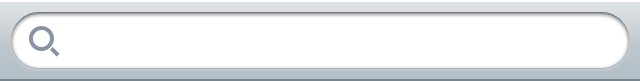](../sprites/UI_tex_06/searchwindow.png) | `searchwindow.png` / 245 | 商店搜索/信息窗口底图 **名称/图像推断**：plist几何 + frame名称 + 图像内容 | `[0, 423, 640, 81]` |
|  | `shop_off.png` / 246 | 商店页面选择；常态/未选中 **名称/图像推断**：plist几何 + frame名称 + 图像内容 | `[939, 55, 79, 54]` |
|  | `shop_on.png` / 247 | 商店页面选择；高亮/选中状态 **名称/图像推断**：plist几何 + frame名称 + 图像内容 | `[939, 0, 79, 54]` |
|  | `shopback_off.png` / 248 | 从商店返回；常态/未选中 **名称/图像推断**：plist几何 + frame名称 + 图像内容 | `[620, 951, 115, 60]` |
|  | `shopback_on.png` / 249 | 从商店返回；高亮/选中状态 **名称/图像推断**：plist几何 + frame名称 + 图像内容 | `[595, 566, 115, 60]` |
