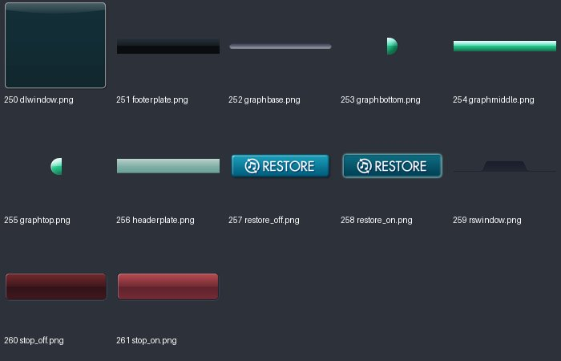

# UI_tex_07：图片与意义

来源：`UI_tex_07.png` + `UI_tex_07.plist`；画布 [1024, 1024]；12个frame。场景：下载进度与恢复购买。

裁切几何来自plist，已确认。用途说明默认按资源名称、图像内容和所属场景解释；只有附有具体函数证据的条目提升为静态确认。on/off一般表示高亮/常态；不保证等于功能启用/禁用。frame序号是程序全局名称表索引，不能当作plist文件里的排列次序。

| 图像（点击看原尺寸） | 名称 / 全局索引 | 意义与证据 | 裁切矩形 x,y,w,h |
|---|---|---|---|
|  | `dlwindow.png` / 250 | 下载窗口底图 **名称/图像推断**：plist几何 + frame名称 + 图像内容 | `[0, 260, 560, 477]` |
|  | `footerplate.png` / 251 | 下载窗口底部底板 **名称/图像推断**：plist几何 + frame名称 + 图像内容 | `[0, 0, 640, 98]` |
|  | `graphbase.png` / 252 | 下载进度条底板 **名称/图像推断**：plist几何 + frame名称 + 图像内容 | `[0, 738, 473, 25]` |
|  | `graphbottom.png` / 253 | 下载进度条底端 **名称/图像推断**：plist几何 + frame名称 + 图像内容 | `[913, 0, 14, 21]` |
|  | `graphmiddle.png` / 254 | 下载进度条可延伸中段 **名称/图像推断**：plist几何 + frame名称 + 图像内容 | `[561, 262, 208, 21]` |
|  | `graphtop.png` / 255 | 下载进度条顶端 **名称/图像推断**：plist几何 + frame名称 + 图像内容 | `[898, 0, 14, 21]` |
|  | `headerplate.png` / 256 | 下载窗口顶部底板 **名称/图像推断**：plist几何 + frame名称 + 图像内容 | `[0, 99, 640, 88]` |
|  | `restore_off.png` / 257 | 恢复购买；常态/未选中 **名称/图像推断**：plist几何 + frame名称 + 图像内容 | `[641, 201, 227, 60]` |
|  | `restore_on.png` / 258 | 恢复购买；高亮/选中状态 **名称/图像推断**：plist几何 + frame名称 + 图像内容 | `[641, 140, 227, 60]` |
|  | `rswindow.png` / 259 | 恢复购买窗口底图 **名称/图像推断**：plist几何 + frame名称 + 图像内容 | `[0, 188, 640, 71]` |
|  | `stop_off.png` / 260 | 停止下载/当前任务；常态/未选中 **名称/图像推断**：plist几何 + frame名称 + 图像内容 | `[641, 70, 256, 69]` |
|  | `stop_on.png` / 261 | 停止下载/当前任务；高亮/选中状态 **名称/图像推断**：plist几何 + frame名称 + 图像内容 | `[641, 0, 256, 69]` |
