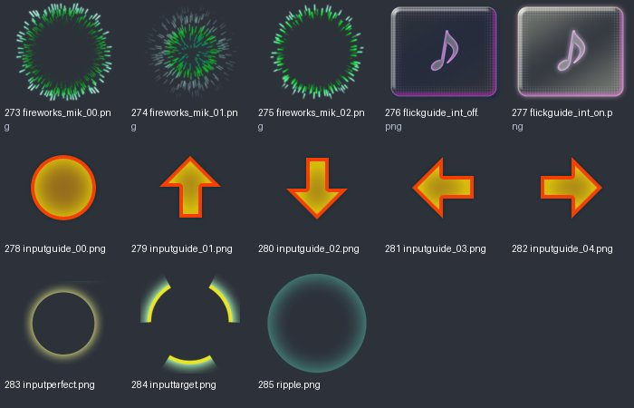
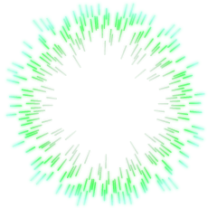
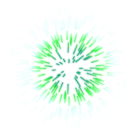
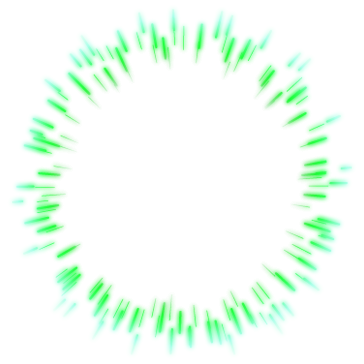

# game_effect_01：图片与意义

来源：`game_effect_01.png` + `game_effect_01.plist`；画布 [1024, 1024]；13个frame。场景：游戏输入特效。

裁切几何来自plist，已确认。用途说明默认按资源名称、图像内容和所属场景解释；只有附有具体函数证据的条目提升为静态确认。on/off一般表示高亮/常态；不保证等于功能启用/禁用。frame序号是程序全局名称表索引，不能当作plist文件里的排列次序。

| 图像（点击看原尺寸） | 名称 / 全局索引 | 意义与证据 | 裁切矩形 x,y,w,h |
|---|---|---|---|
|  | `fireworks_mik_00.png` / 273 | 游戏烟花/闪光动画帧；变体 00 **名称/图像推断**：plist几何 + frame名称 + 图像内容 | `[462, 351, 230, 230]` |
|  | `fireworks_mik_01.png` / 274 | 游戏烟花/闪光动画帧；变体 01 **名称/图像推断**：plist几何 + frame名称 + 图像内容 | `[231, 764, 230, 230]` |
|  | `fireworks_mik_02.png` / 275 | 游戏烟花/闪光动画帧；变体 02 **名称/图像推断**：plist几何 + frame名称 + 图像内容 | `[0, 399, 364, 364]` |
|  | `flickguide_int_off.png` / 276 | 间奏滑动提示；变体 off **名称/图像推断**：plist几何 + frame名称 + 图像内容 | `[410, 0, 409, 350]` |
|  | `flickguide_int_on.png` / 277 | 间奏滑动提示；变体 on **名称/图像推断**：plist几何 + frame名称 + 图像内容 | `[0, 0, 409, 350]` |
|  | `inputguide_00.png` / 278 | 输入方向/位置引导特效；变体 00 **名称/图像推断**：plist几何 + frame名称 + 图像内容 | `[820, 316, 82, 82]` |
|  | `inputguide_01.png` / 279 | 输入方向/位置引导特效；变体 01 **名称/图像推断**：plist几何 + frame名称 + 图像内容 | `[903, 304, 82, 82]` |
|  | `inputguide_02.png` / 280 | 输入方向/位置引导特效；变体 02 **名称/图像推断**：plist几何 + frame名称 + 图像内容 | `[820, 233, 82, 82]` |
|  | `inputguide_03.png` / 281 | 输入方向/位置引导特效；变体 03 **名称/图像推断**：plist几何 + frame名称 + 图像内容 | `[915, 221, 82, 82]` |
|  | `inputguide_04.png` / 282 | 输入方向/位置引导特效；变体 04 **名称/图像推断**：plist几何 + frame名称 + 图像内容 | `[915, 138, 82, 82]` |
|  | `inputperfect.png` / 283 | 完美输入特效文字/符号 **名称/图像推断**：plist几何 + frame名称 + 图像内容 | `[820, 138, 94, 94]` |
|  | `inputtarget.png` / 284 | 输入目标标记 **名称/图像推断**：plist几何 + frame名称 + 图像内容 | `[820, 0, 137, 137]` |
|  | `ripple.png` / 285 | 触摸涟漪 **名称/图像推断**：plist几何 + frame名称 + 图像内容 | `[0, 764, 230, 230]` |
