# game_tex_01：图片与意义

来源：`game_tex_01.png` + `game_tex_01.plist`；画布 [1024, 1024]；84个frame。场景：游戏HUD、判定与引导。

裁切几何来自plist，已确认。用途说明默认按资源名称、图像内容和所属场景解释；只有附有具体函数证据的条目提升为静态确认。on/off一般表示高亮/常态；不保证等于功能启用/禁用。frame序号是程序全局名称表索引，不能当作plist文件里的排列次序。

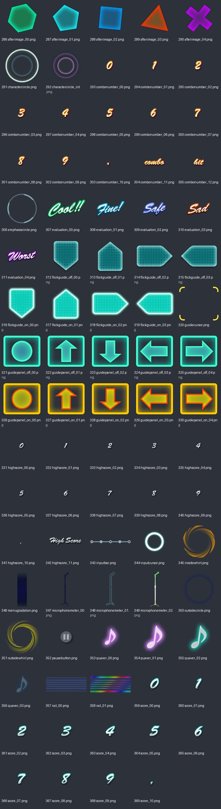

| 图像（点击看原尺寸） | 名称 / 全局索引 | 意义与证据 | 裁切矩形 x,y,w,h |
|---|---|---|---|
| [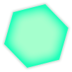](../sprites/game_tex_01/afterimage_00.png) | `afterimage_00.png` / 286 | 输入或目标的残影帧；变体 00 **名称/图像推断**：plist几何 + frame名称 + 图像内容 | `[725, 576, 102, 102]` |
| [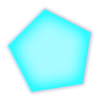](../sprites/game_tex_01/afterimage_01.png) | `afterimage_01.png` / 287 | 输入或目标的残影帧；变体 01 **名称/图像推断**：plist几何 + frame名称 + 图像内容 | `[725, 473, 102, 102]` |
|  | `afterimage_02.png` / 288 | 输入或目标的残影帧；变体 02 **名称/图像推断**：plist几何 + frame名称 + 图像内容 | `[725, 370, 102, 102]` |
|  | `afterimage_03.png` / 289 | 输入或目标的残影帧；变体 03 **名称/图像推断**：plist几何 + frame名称 + 图像内容 | `[387, 0, 102, 102]` |
|  | `afterimage_04.png` / 290 | 输入或目标的残影帧；变体 04 **名称/图像推断**：plist几何 + frame名称 + 图像内容 | `[495, 28, 102, 102]` |
|  | `charactercircle.png` / 291 | 字符目标圆环 **名称/图像推断**：plist几何 + frame名称 + 图像内容 | `[374, 234, 120, 120]` |
|  | `charactercircle_int.png` / 292 | 间奏目标圆环 **名称/图像推断**：plist几何 + frame名称 + 图像内容 | `[354, 355, 140, 143]` |
|  | `combonumber_00.png` / 293 | 连击数字0 **名称/图像推断**：plist几何 + frame名称 + 图像内容 | `[992, 441, 29, 39]` |
|  | `combonumber_01.png` / 294 | 连击数字1 **名称/图像推断**：plist几何 + frame名称 + 图像内容 | `[994, 401, 29, 39]` |
|  | `combonumber_02.png` / 295 | 连击数字2 **名称/图像推断**：plist几何 + frame名称 + 图像内容 | `[994, 361, 29, 39]` |
|  | `combonumber_03.png` / 296 | 连击数字3 **名称/图像推断**：plist几何 + frame名称 + 图像内容 | `[495, 450, 29, 39]` |
|  | `combonumber_04.png` / 297 | 连击数字4 **名称/图像推断**：plist几何 + frame名称 + 图像内容 | `[495, 410, 29, 39]` |
|  | `combonumber_05.png` / 298 | 连击数字5 **名称/图像推断**：plist几何 + frame名称 + 图像内容 | `[706, 234, 29, 39]` |
|  | `combonumber_06.png` / 299 | 连击数字6 **名称/图像推断**：plist几何 + frame名称 + 图像内容 | `[495, 234, 29, 39]` |
|  | `combonumber_07.png` / 300 | 连击数字7 **名称/图像推断**：plist几何 + frame名称 + 图像内容 | `[526, 234, 29, 39]` |
|  | `combonumber_08.png` / 301 | 连击数字8 **名称/图像推断**：plist几何 + frame名称 + 图像内容 | `[563, 211, 29, 39]` |
|  | `combonumber_09.png` / 302 | 连击数字9 **名称/图像推断**：plist几何 + frame名称 + 图像内容 | `[563, 171, 29, 39]` |
| [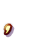](../sprites/game_tex_01/combonumber_10.png) | `combonumber_10.png` / 303 | 连击标签或符号贴图10（以图片内容为准） **名称/图像推断**：plist几何 + frame名称 + 图像内容 | `[563, 131, 29, 39]` |
|  | `combonumber_11.png` / 304 | 连击标签或符号贴图11（以图片内容为准） **名称/图像推断**：plist几何 + frame名称 + 图像内容 | `[593, 234, 72, 39]` |
|  | `combonumber_12.png` / 305 | 连击标签或符号贴图12（以图片内容为准） **名称/图像推断**：plist几何 + frame名称 + 图像内容 | `[666, 234, 39, 39]` |
|  | `emphasiscircle.png` / 306 | 强调圆环 **名称/图像推断**：plist几何 + frame名称 + 图像内容 | `[519, 589, 99, 98]` |
|  | `evaluation_00.png` / 307 | COOL判定文字贴图；数值判定规则见mechanics.md **名称/图像推断**：plist几何 + frame名称 + 图像内容 | `[828, 641, 142, 69]` |
|  | `evaluation_01.png` / 308 | FINE判定文字贴图；数值判定规则见mechanics.md **名称/图像推断**：plist几何 + frame名称 + 图像内容 | `[828, 571, 142, 69]` |
|  | `evaluation_02.png` / 309 | SAFE判定文字贴图；数值判定规则见mechanics.md **名称/图像推断**：plist几何 + frame名称 + 图像内容 | `[849, 501, 142, 69]` |
|  | `evaluation_03.png` / 310 | SAD判定文字贴图；数值判定规则见mechanics.md **名称/图像推断**：plist几何 + frame名称 + 图像内容 | `[849, 431, 142, 69]` |
|  | `evaluation_04.png` / 311 | WORST判定文字贴图；数值判定规则见mechanics.md **名称/图像推断**：plist几何 + frame名称 + 图像内容 | `[851, 361, 142, 69]` |
| [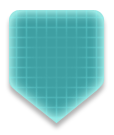](../sprites/game_tex_01/flickguide_off_00.png) | `flickguide_off_00.png` / 312 | 滑动方向引导；变体 off_00 **名称/图像推断**：plist几何 + frame名称 + 图像内容 | `[736, 234, 114, 135]` |
| [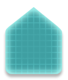](../sprites/game_tex_01/flickguide_off_01.png) | `flickguide_off_01.png` / 313 | 滑动方向引导；变体 off_01 **名称/图像推断**：plist几何 + frame名称 + 图像内容 | `[610, 274, 114, 135]` |
| [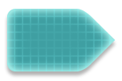](../sprites/game_tex_01/flickguide_off_02.png) | `flickguide_off_02.png` / 314 | 滑动方向引导；变体 off_02 **名称/图像推断**：plist几何 + frame名称 + 图像内容 | `[851, 258, 154, 102]` |
| [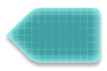](../sprites/game_tex_01/flickguide_off_03.png) | `flickguide_off_03.png` / 315 | 滑动方向引导；变体 off_03 **名称/图像推断**：plist几何 + frame名称 + 图像内容 | `[408, 131, 154, 102]` |
|  | `flickguide_on_00.png` / 316 | 滑动方向引导；变体 on_00 **名称/图像推断**：plist几何 + frame名称 + 图像内容 | `[526, 410, 114, 135]` |
| [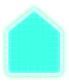](../sprites/game_tex_01/flickguide_on_01.png) | `flickguide_on_01.png` / 317 | 滑动方向引导；变体 on_01 **名称/图像推断**：plist几何 + frame名称 + 图像内容 | `[495, 274, 114, 135]` |
| [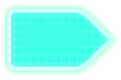](../sprites/game_tex_01/flickguide_on_02.png) | `flickguide_on_02.png` / 318 | 滑动方向引导；变体 on_02 **名称/图像推断**：plist几何 + frame名称 + 图像内容 | `[253, 131, 154, 102]` |
| [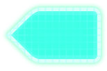](../sprites/game_tex_01/flickguide_on_03.png) | `flickguide_on_03.png` / 319 | 滑动方向引导；变体 on_03 **名称/图像推断**：plist几何 + frame名称 + 图像内容 | `[860, 155, 154, 102]` |
|  | `guidecursor.png` / 320 | 引导光标 **名称/图像推断**：plist几何 + frame名称 + 图像内容 | `[253, 0, 133, 114]` |
|  | `guidepanel_off_00.png` / 321 | 键盘引导面板；变体 off_00 **名称/图像推断**：plist几何 + frame名称 + 图像内容 | `[519, 916, 127, 108]` |
|  | `guidepanel_off_01.png` / 322 | 键盘引导面板；变体 off_01 **名称/图像推断**：plist几何 + frame名称 + 图像内容 | `[519, 807, 127, 108]` |
|  | `guidepanel_off_02.png` / 323 | 键盘引导面板；变体 off_02 **名称/图像推断**：plist几何 + frame名称 + 图像内容 | `[391, 914, 127, 108]` |
|  | `guidepanel_off_03.png` / 324 | 键盘引导面板；变体 off_03 **名称/图像推断**：plist几何 + frame名称 + 图像内容 | `[391, 805, 127, 108]` |
|  | `guidepanel_off_04.png` / 325 | 键盘引导面板；变体 off_04 **名称/图像推断**：plist几何 + frame名称 + 图像内容 | `[602, 698, 127, 108]` |
|  | `guidepanel_on_00.png` / 326 | 键盘引导面板；变体 on_00 **名称/图像推断**：plist几何 + frame名称 + 图像内容 | `[391, 696, 127, 108]` |
|  | `guidepanel_on_01.png` / 327 | 键盘引导面板；变体 on_01 **名称/图像推断**：plist几何 + frame名称 + 图像内容 | `[391, 587, 127, 108]` |
|  | `guidepanel_on_02.png` / 328 | 键盘引导面板；变体 on_02 **名称/图像推断**：plist几何 + frame名称 + 图像内容 | `[263, 820, 127, 108]` |
|  | `guidepanel_on_03.png` / 329 | 键盘引导面板；变体 on_03 **名称/图像推断**：plist几何 + frame名称 + 图像内容 | `[263, 594, 127, 108]` |
|  | `guidepanel_on_04.png` / 330 | 键盘引导面板；变体 on_04 **名称/图像推断**：plist几何 + frame名称 + 图像内容 | `[263, 711, 127, 108]` |
|  | `highscore_00.png` / 331 | 最高分数字0 **名称/图像推断**：plist几何 + frame名称 + 图像内容 | `[828, 500, 20, 25]` |
|  | `highscore_01.png` / 332 | 最高分数字1 **名称/图像推断**：plist几何 + frame名称 + 图像内容 | `[828, 474, 20, 25]` |
|  | `highscore_02.png` / 333 | 最高分数字2 **名称/图像推断**：plist几何 + frame名称 + 图像内容 | `[828, 448, 20, 25]` |
|  | `highscore_03.png` / 334 | 最高分数字3 **名称/图像推断**：plist几何 + frame名称 + 图像内容 | `[828, 422, 20, 25]` |
|  | `highscore_04.png` / 335 | 最高分数字4 **名称/图像推断**：plist几何 + frame名称 + 图像内容 | `[828, 396, 20, 25]` |
|  | `highscore_05.png` / 336 | 最高分数字5 **名称/图像推断**：plist几何 + frame名称 + 图像内容 | `[828, 370, 20, 25]` |
|  | `highscore_06.png` / 337 | 最高分数字6 **名称/图像推断**：plist几何 + frame名称 + 图像内容 | `[471, 103, 20, 25]` |
|  | `highscore_07.png` / 338 | 最高分数字7 **名称/图像推断**：plist几何 + frame名称 + 图像内容 | `[450, 103, 20, 25]` |
|  | `highscore_08.png` / 339 | 最高分数字8 **名称/图像推断**：plist几何 + frame名称 + 图像内容 | `[429, 103, 20, 25]` |
|  | `highscore_09.png` / 340 | 最高分数字9 **名称/图像推断**：plist几何 + frame名称 + 图像内容 | `[408, 103, 20, 25]` |
|  | `highscore_10.png` / 341 | 最高分标签或符号贴图10（以图片内容为准） **名称/图像推断**：plist几何 + frame名称 + 图像内容 | `[387, 103, 20, 25]` |
|  | `highscore_11.png` / 342 | 最高分标签或符号贴图11（以图片内容为准） **名称/图像推断**：plist几何 + frame名称 + 图像内容 | `[495, 0, 105, 27]` |
|  | `inputbar.png` / 343 | 输入提示条 **名称/图像推断**：plist几何 + frame名称 + 图像内容 | `[161, 556, 439, 30]` |
|  | `inputcursor.png` / 344 | 输入位置光标 **名称/图像推断**：plist几何 + frame名称 + 图像内容 | `[280, 929, 69, 68]` |
|  | `insidewhirl.png` / 345 | 内侧旋转装饰 **名称/图像推断**：plist几何 + frame名称 + 图像内容 | `[253, 234, 120, 120]` |
|  | `menugradation.png` / 346 | 暂停菜单渐变遮罩 **名称/图像推断**：plist几何 + frame名称 + 图像内容 | `[0, 0, 160, 586]` |
|  | `microphonemeter_00.png` / 347 | 演唱/Gauge显示部件；变体 00 **名称/图像推断**：plist几何 + frame名称 + 图像内容 | `[0, 587, 146, 388]` |
|  | `microphonemeter_01.png` / 348 | 演唱/Gauge显示部件；变体 01 **名称/图像推断**：plist几何 + frame名称 + 图像内容 | `[147, 587, 115, 388]` |
|  | `microphonemeter_02.png` / 349 | 演唱/Gauge显示部件；变体 02 **名称/图像推断**：plist几何 + frame名称 + 图像内容 | `[161, 0, 91, 362]` |
|  | `outsidecircle.png` / 350 | 目标外圆 **名称/图像推断**：plist几何 + frame名称 + 图像内容 | `[862, 0, 154, 154]` |
|  | `outsidewhirl.png` / 351 | 外侧旋转装饰 **名称/图像推断**：plist几何 + frame名称 + 图像内容 | `[161, 363, 192, 192]` |
|  | `pausebutton.png` / 352 | 暂停按钮 **名称/图像推断**：plist几何 + frame名称 + 图像内容 | `[354, 499, 51, 51]` |
|  | `quaver_00.png` / 353 | 音符/节奏提示装饰；变体 00 **名称/图像推断**：plist几何 + frame名称 + 图像内容 | `[641, 502, 83, 91]` |
|  | `quaver_01.png` / 354 | 音符/节奏提示装饰；变体 01 **名称/图像推断**：plist几何 + frame名称 + 图像内容 | `[519, 688, 82, 103]` |
|  | `quaver_02.png` / 355 | 音符/节奏提示装饰；变体 02 **名称/图像推断**：plist几何 + frame名称 + 图像内容 | `[619, 594, 82, 103]` |
|  | `quaver_03.png` / 356 | 音符/节奏提示装饰；变体 03 **名称/图像推断**：plist几何 + frame名称 + 图像内容 | `[641, 410, 83, 91]` |
|  | `rail_00.png` / 357 | 音符运动轨道；变体 00 **名称/图像推断**：plist几何 + frame名称 + 图像内容 | `[601, 117, 258, 116]` |
| [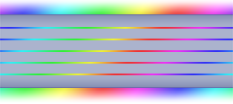](../sprites/game_tex_01/rail_01.png) | `rail_01.png` / 358 | 音符运动轨道；变体 01 **名称/图像推断**：plist几何 + frame名称 + 图像内容 | `[601, 0, 260, 116]` |
|  | `score_00.png` / 359 | 当前得分数字0 **名称/图像推断**：plist几何 + frame名称 + 图像内容 | `[601, 546, 39, 42]` |
|  | `score_01.png` / 360 | 当前得分数字1 **名称/图像推断**：plist几何 + frame名称 + 图像内容 | `[486, 499, 39, 42]` |
|  | `score_02.png` / 361 | 当前得分数字2 **名称/图像推断**：plist几何 + frame名称 + 图像内容 | `[446, 499, 39, 42]` |
|  | `score_03.png` / 362 | 当前得分数字3 **名称/图像推断**：plist几何 + frame名称 + 图像内容 | `[406, 499, 39, 42]` |
|  | `score_04.png` / 363 | 当前得分数字4 **名称/图像推断**：plist几何 + frame名称 + 图像内容 | `[240, 976, 39, 42]` |
|  | `score_05.png` / 364 | 当前得分数字5 **名称/图像推断**：plist几何 + frame名称 + 图像内容 | `[200, 976, 39, 42]` |
|  | `score_06.png` / 365 | 当前得分数字6 **名称/图像推断**：plist几何 + frame名称 + 图像内容 | `[160, 976, 39, 42]` |
|  | `score_07.png` / 366 | 当前得分数字7 **名称/图像推断**：plist几何 + frame名称 + 图像内容 | `[120, 976, 39, 42]` |
|  | `score_08.png` / 367 | 当前得分数字8 **名称/图像推断**：plist几何 + frame名称 + 图像内容 | `[80, 976, 39, 42]` |
|  | `score_09.png` / 368 | 当前得分数字9 **名称/图像推断**：plist几何 + frame名称 + 图像内容 | `[40, 976, 39, 42]` |
|  | `score_10.png` / 369 | 当前得分标签或符号贴图10（以图片内容为准） **名称/图像推断**：plist几何 + frame名称 + 图像内容 | `[0, 976, 39, 42]` |
