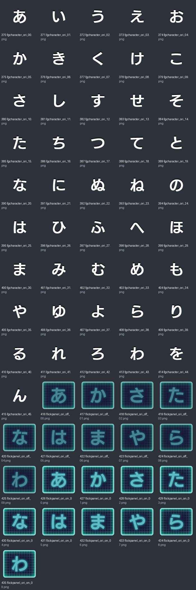
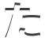
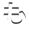
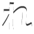
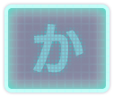
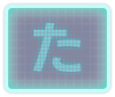
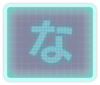
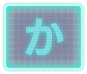
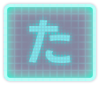
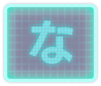

# game_tex_02：图片与意义

来源：`game_tex_02.png` + `game_tex_02.plist`；画布 [512, 1024]；66个frame。场景：原始假名键盘。

裁切几何来自plist，已确认。用途说明默认按资源名称、图像内容和所属场景解释；只有附有具体函数证据的条目提升为静态确认。on/off一般表示高亮/常态；不保证等于功能启用/禁用。frame序号是程序全局名称表索引，不能当作plist文件里的排列次序。

| 图像（点击看原尺寸） | 名称 / 全局索引 | 意义与证据 | 裁切矩形 x,y,w,h |
|---|---|---|---|
|  | `fgcharacter_ori_00.png` / 370 | 假名滑动引导字符字形第00项；此编号不是Unicode码点 **名称/图像推断**：plist几何 + frame名称 + 图像内容 | `[290, 719, 57, 57]` |
|  | `fgcharacter_ori_01.png` / 371 | 假名滑动引导字符字形第01项；此编号不是Unicode码点 **名称/图像推断**：plist几何 + frame名称 + 图像内容 | `[232, 719, 57, 57]` |
|  | `fgcharacter_ori_02.png` / 372 | 假名滑动引导字符字形第02项；此编号不是Unicode码点 **名称/图像推断**：plist几何 + frame名称 + 图像内容 | `[174, 951, 57, 57]` |
|  | `fgcharacter_ori_03.png` / 373 | 假名滑动引导字符字形第03项；此编号不是Unicode码点 **名称/图像推断**：plist几何 + frame名称 + 图像内容 | `[174, 893, 57, 57]` |
|  | `fgcharacter_ori_04.png` / 374 | 假名滑动引导字符字形第04项；此编号不是Unicode码点 **名称/图像推断**：plist几何 + frame名称 + 图像内容 | `[174, 835, 57, 57]` |
|  | `fgcharacter_ori_05.png` / 375 | 假名滑动引导字符字形第05项；此编号不是Unicode码点 **名称/图像推断**：plist几何 + frame名称 + 图像内容 | `[174, 777, 57, 57]` |
|  | `fgcharacter_ori_06.png` / 376 | 假名滑动引导字符字形第06项；此编号不是Unicode码点 **名称/图像推断**：plist几何 + frame名称 + 图像内容 | `[174, 719, 57, 57]` |
|  | `fgcharacter_ori_07.png` / 377 | 假名滑动引导字符字形第07项；此编号不是Unicode码点 **名称/图像推断**：plist几何 + frame名称 + 图像内容 | `[406, 661, 57, 57]` |
|  | `fgcharacter_ori_08.png` / 378 | 假名滑动引导字符字形第08项；此编号不是Unicode码点 **名称/图像推断**：plist几何 + frame名称 + 图像内容 | `[348, 661, 57, 57]` |
|  | `fgcharacter_ori_09.png` / 379 | 假名滑动引导字符字形第09项；此编号不是Unicode码点 **名称/图像推断**：plist几何 + frame名称 + 图像内容 | `[290, 661, 57, 57]` |
|  | `fgcharacter_ori_10.png` / 380 | 假名滑动引导字符字形第10项；此编号不是Unicode码点 **名称/图像推断**：plist几何 + frame名称 + 图像内容 | `[232, 661, 57, 57]` |
|  | `fgcharacter_ori_11.png` / 381 | 假名滑动引导字符字形第11项；此编号不是Unicode码点 **名称/图像推断**：plist几何 + frame名称 + 图像内容 | `[174, 661, 57, 57]` |
|  | `fgcharacter_ori_12.png` / 382 | 假名滑动引导字符字形第12项；此编号不是Unicode码点 **名称/图像推断**：plist几何 + frame名称 + 图像内容 | `[116, 951, 57, 57]` |
|  | `fgcharacter_ori_13.png` / 383 | 假名滑动引导字符字形第13项；此编号不是Unicode码点 **名称/图像推断**：plist几何 + frame名称 + 图像内容 | `[116, 893, 57, 57]` |
|  | `fgcharacter_ori_14.png` / 384 | 假名滑动引导字符字形第14项；此编号不是Unicode码点 **名称/图像推断**：plist几何 + frame名称 + 图像内容 | `[116, 835, 57, 57]` |
|  | `fgcharacter_ori_15.png` / 385 | 假名滑动引导字符字形第15项；此编号不是Unicode码点 **名称/图像推断**：plist几何 + frame名称 + 图像内容 | `[116, 777, 57, 57]` |
|  | `fgcharacter_ori_16.png` / 386 | 假名滑动引导字符字形第16项；此编号不是Unicode码点 **名称/图像推断**：plist几何 + frame名称 + 图像内容 | `[116, 719, 57, 57]` |
|  | `fgcharacter_ori_17.png` / 387 | 假名滑动引导字符字形第17项；此编号不是Unicode码点 **名称/图像推断**：plist几何 + frame名称 + 图像内容 | `[116, 661, 57, 57]` |
|  | `fgcharacter_ori_18.png` / 388 | 假名滑动引导字符字形第18项；此编号不是Unicode码点 **名称/图像推断**：plist几何 + frame名称 + 图像内容 | `[406, 603, 57, 57]` |
|  | `fgcharacter_ori_19.png` / 389 | 假名滑动引导字符字形第19项；此编号不是Unicode码点 **名称/图像推断**：plist几何 + frame名称 + 图像内容 | `[348, 603, 57, 57]` |
|  | `fgcharacter_ori_20.png` / 390 | 假名滑动引导字符字形第20项；此编号不是Unicode码点 **名称/图像推断**：plist几何 + frame名称 + 图像内容 | `[290, 603, 57, 57]` |
|  | `fgcharacter_ori_21.png` / 391 | 假名滑动引导字符字形第21项；此编号不是Unicode码点 **名称/图像推断**：plist几何 + frame名称 + 图像内容 | `[232, 603, 57, 57]` |
|  | `fgcharacter_ori_22.png` / 392 | 假名滑动引导字符字形第22项；此编号不是Unicode码点 **名称/图像推断**：plist几何 + frame名称 + 图像内容 | `[174, 603, 57, 57]` |
|  | `fgcharacter_ori_23.png` / 393 | 假名滑动引导字符字形第23项；此编号不是Unicode码点 **名称/图像推断**：plist几何 + frame名称 + 图像内容 | `[116, 603, 57, 57]` |
|  | `fgcharacter_ori_24.png` / 394 | 假名滑动引导字符字形第24项；此编号不是Unicode码点 **名称/图像推断**：plist几何 + frame名称 + 图像内容 | `[58, 951, 57, 57]` |
|  | `fgcharacter_ori_25.png` / 395 | 假名滑动引导字符字形第25项；此编号不是Unicode码点 **名称/图像推断**：plist几何 + frame名称 + 图像内容 | `[58, 893, 57, 57]` |
|  | `fgcharacter_ori_26.png` / 396 | 假名滑动引导字符字形第26项；此编号不是Unicode码点 **名称/图像推断**：plist几何 + frame名称 + 图像内容 | `[58, 835, 57, 57]` |
|  | `fgcharacter_ori_27.png` / 397 | 假名滑动引导字符字形第27项；此编号不是Unicode码点 **名称/图像推断**：plist几何 + frame名称 + 图像内容 | `[58, 777, 57, 57]` |
|  | `fgcharacter_ori_28.png` / 398 | 假名滑动引导字符字形第28项；此编号不是Unicode码点 **名称/图像推断**：plist几何 + frame名称 + 图像内容 | `[58, 719, 57, 57]` |
|  | `fgcharacter_ori_29.png` / 399 | 假名滑动引导字符字形第29项；此编号不是Unicode码点 **名称/图像推断**：plist几何 + frame名称 + 图像内容 | `[58, 661, 57, 57]` |
|  | `fgcharacter_ori_30.png` / 400 | 假名滑动引导字符字形第30项；此编号不是Unicode码点 **名称/图像推断**：plist几何 + frame名称 + 图像内容 | `[58, 603, 57, 57]` |
|  | `fgcharacter_ori_31.png` / 401 | 假名滑动引导字符字形第31项；此编号不是Unicode码点 **名称/图像推断**：plist几何 + frame名称 + 图像内容 | `[406, 545, 57, 57]` |
|  | `fgcharacter_ori_32.png` / 402 | 假名滑动引导字符字形第32项；此编号不是Unicode码点 **名称/图像推断**：plist几何 + frame名称 + 图像内容 | `[348, 545, 57, 57]` |
|  | `fgcharacter_ori_33.png` / 403 | 假名滑动引导字符字形第33项；此编号不是Unicode码点 **名称/图像推断**：plist几何 + frame名称 + 图像内容 | `[290, 545, 57, 57]` |
|  | `fgcharacter_ori_34.png` / 404 | 假名滑动引导字符字形第34项；此编号不是Unicode码点 **名称/图像推断**：plist几何 + frame名称 + 图像内容 | `[232, 545, 57, 57]` |
|  | `fgcharacter_ori_35.png` / 405 | 假名滑动引导字符字形第35项；此编号不是Unicode码点 **名称/图像推断**：plist几何 + frame名称 + 图像内容 | `[174, 545, 57, 57]` |
|  | `fgcharacter_ori_36.png` / 406 | 假名滑动引导字符字形第36项；此编号不是Unicode码点 **名称/图像推断**：plist几何 + frame名称 + 图像内容 | `[116, 545, 57, 57]` |
|  | `fgcharacter_ori_37.png` / 407 | 假名滑动引导字符字形第37项；此编号不是Unicode码点 **名称/图像推断**：plist几何 + frame名称 + 图像内容 | `[58, 545, 57, 57]` |
|  | `fgcharacter_ori_38.png` / 408 | 假名滑动引导字符字形第38项；此编号不是Unicode码点 **名称/图像推断**：plist几何 + frame名称 + 图像内容 | `[0, 951, 57, 57]` |
|  | `fgcharacter_ori_39.png` / 409 | 假名滑动引导字符字形第39项；此编号不是Unicode码点 **名称/图像推断**：plist几何 + frame名称 + 图像内容 | `[0, 893, 57, 57]` |
|  | `fgcharacter_ori_40.png` / 410 | 假名滑动引导字符字形第40项；此编号不是Unicode码点 **名称/图像推断**：plist几何 + frame名称 + 图像内容 | `[0, 835, 57, 57]` |
|  | `fgcharacter_ori_41.png` / 411 | 假名滑动引导字符字形第41项；此编号不是Unicode码点 **名称/图像推断**：plist几何 + frame名称 + 图像内容 | `[0, 777, 57, 57]` |
|  | `fgcharacter_ori_42.png` / 412 | 假名滑动引导字符字形第42项；此编号不是Unicode码点 **名称/图像推断**：plist几何 + frame名称 + 图像内容 | `[0, 719, 57, 57]` |
|  | `fgcharacter_ori_43.png` / 413 | 假名滑动引导字符字形第43项；此编号不是Unicode码点 **名称/图像推断**：plist几何 + frame名称 + 图像内容 | `[0, 661, 57, 57]` |
|  | `fgcharacter_ori_44.png` / 414 | 假名滑动引导字符字形第44项；此编号不是Unicode码点 **名称/图像推断**：plist几何 + frame名称 + 图像内容 | `[0, 603, 57, 57]` |
|  | `fgcharacter_ori_45.png` / 415 | 假名滑动引导字符字形第45项；此编号不是Unicode码点 **名称/图像推断**：plist几何 + frame名称 + 图像内容 | `[0, 545, 57, 57]` |
|  | `flickpanel_ori_off_00.png` / 416 | 原始假名十键面板第00项；常态 **名称/图像推断**：plist几何 + frame名称 + 图像内容 | `[384, 436, 127, 108]` |
|  | `flickpanel_ori_off_01.png` / 417 | 原始假名十键面板第01项；常态 **名称/图像推断**：plist几何 + frame名称 + 图像内容 | `[256, 436, 127, 108]` |
|  | `flickpanel_ori_off_02.png` / 418 | 原始假名十键面板第02项；常态 **名称/图像推断**：plist几何 + frame名称 + 图像内容 | `[128, 436, 127, 108]` |
|  | `flickpanel_ori_off_03.png` / 419 | 原始假名十键面板第03项；常态 **名称/图像推断**：plist几何 + frame名称 + 图像内容 | `[0, 436, 127, 108]` |
|  | `flickpanel_ori_off_04.png` / 420 | 原始假名十键面板第04项；常态 **名称/图像推断**：plist几何 + frame名称 + 图像内容 | `[384, 327, 127, 108]` |
|  | `flickpanel_ori_off_05.png` / 421 | 原始假名十键面板第05项；常态 **名称/图像推断**：plist几何 + frame名称 + 图像内容 | `[256, 327, 127, 108]` |
|  | `flickpanel_ori_off_06.png` / 422 | 原始假名十键面板第06项；常态 **名称/图像推断**：plist几何 + frame名称 + 图像内容 | `[128, 327, 127, 108]` |
|  | `flickpanel_ori_off_07.png` / 423 | 原始假名十键面板第07项；常态 **名称/图像推断**：plist几何 + frame名称 + 图像内容 | `[0, 327, 127, 108]` |
|  | `flickpanel_ori_off_08.png` / 424 | 原始假名十键面板第08项；常态 **名称/图像推断**：plist几何 + frame名称 + 图像内容 | `[384, 218, 127, 108]` |
|  | `flickpanel_ori_off_09.png` / 425 | 原始假名十键面板第09项；常态 **名称/图像推断**：plist几何 + frame名称 + 图像内容 | `[256, 218, 127, 108]` |
|  | `flickpanel_ori_on_00.png` / 426 | 原始假名十键面板第00项；按下/高亮 **名称/图像推断**：plist几何 + frame名称 + 图像内容 | `[128, 218, 127, 108]` |
|  | `flickpanel_ori_on_01.png` / 427 | 原始假名十键面板第01项；按下/高亮 **名称/图像推断**：plist几何 + frame名称 + 图像内容 | `[0, 218, 127, 108]` |
|  | `flickpanel_ori_on_02.png` / 428 | 原始假名十键面板第02项；按下/高亮 **名称/图像推断**：plist几何 + frame名称 + 图像内容 | `[384, 109, 127, 108]` |
|  | `flickpanel_ori_on_03.png` / 429 | 原始假名十键面板第03项；按下/高亮 **名称/图像推断**：plist几何 + frame名称 + 图像内容 | `[256, 109, 127, 108]` |
|  | `flickpanel_ori_on_04.png` / 430 | 原始假名十键面板第04项；按下/高亮 **名称/图像推断**：plist几何 + frame名称 + 图像内容 | `[128, 109, 127, 108]` |
|  | `flickpanel_ori_on_05.png` / 431 | 原始假名十键面板第05项；按下/高亮 **名称/图像推断**：plist几何 + frame名称 + 图像内容 | `[0, 109, 127, 108]` |
|  | `flickpanel_ori_on_06.png` / 432 | 原始假名十键面板第06项；按下/高亮 **名称/图像推断**：plist几何 + frame名称 + 图像内容 | `[384, 0, 127, 108]` |
|  | `flickpanel_ori_on_07.png` / 433 | 原始假名十键面板第07项；按下/高亮 **名称/图像推断**：plist几何 + frame名称 + 图像内容 | `[256, 0, 127, 108]` |
|  | `flickpanel_ori_on_08.png` / 434 | 原始假名十键面板第08项；按下/高亮 **名称/图像推断**：plist几何 + frame名称 + 图像内容 | `[128, 0, 127, 108]` |
|  | `flickpanel_ori_on_09.png` / 435 | 原始假名十键面板第09项；按下/高亮 **名称/图像推断**：plist几何 + frame名称 + 图像内容 | `[0, 0, 127, 108]` |
