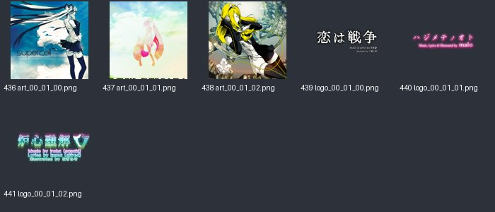

# music_00_01：图片与意义

来源：`music_00_01.png` + `music_00_01.plist`；画布 [1024, 1024]；6个frame。场景：预装歌曲封面与标题。

裁切几何来自plist，已确认。用途说明默认按资源名称、图像内容和所属场景解释；只有附有具体函数证据的条目提升为静态确认。on/off一般表示高亮/常态；不保证等于功能启用/禁用。frame序号是程序全局名称表索引，不能当作plist文件里的排列次序。

| 图像（点击看原尺寸） | 名称 / 全局索引 | 意义与证据 | 裁切矩形 x,y,w,h |
|---|---|---|---|
|  | `art_00_01_00.png` / 436 | 恋は戦争封面插画；按歌曲表与图像对应 **名称/图像推断**：plist几何 + frame名称 + 图像内容 | `[513, 576, 318, 318]` |
|  | `art_00_01_01.png` / 437 | ハジメテノオト封面插画；按歌曲表与图像对应 **名称/图像推断**：plist几何 + frame名称 + 图像内容 | `[513, 257, 318, 318]` |
|  | `art_00_01_02.png` / 438 | 炉心融解封面插画；按歌曲表与图像对应 **名称/图像推断**：plist几何 + frame名称 + 图像内容 | `[0, 0, 318, 318]` |
|  | `logo_00_01_00.png` / 439 | 恋は戦争歌曲标题Logo；按歌曲表与图像对应 **名称/图像推断**：plist几何 + frame名称 + 图像内容 | `[0, 576, 512, 256]` |
|  | `logo_00_01_01.png` / 440 | ハジメテノオト歌曲标题Logo；按歌曲表与图像对应 **名称/图像推断**：plist几何 + frame名称 + 图像内容 | `[319, 0, 512, 256]` |
|  | `logo_00_01_02.png` / 441 | 炉心融解歌曲标题Logo；按歌曲表与图像对应 **名称/图像推断**：plist几何 + frame名称 + 图像内容 | `[0, 319, 512, 256]` |
