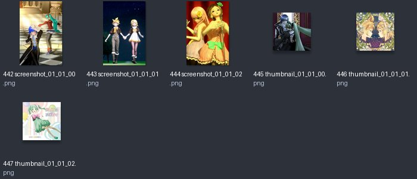
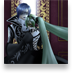
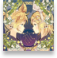

# thum_01_01：图片与意义

来源：`thum_01_01.png` + `thum_01_01.plist`；画布 [512, 512]；6个frame。场景：附加歌曲介绍图片；当前包缺少动态商店配置。

裁切几何来自plist，已确认。用途说明默认按资源名称、图像内容和所属场景解释；只有附有具体函数证据的条目提升为静态确认。on/off一般表示高亮/常态；不保证等于功能启用/禁用。frame序号是程序全局名称表索引，不能当作plist文件里的排列次序。

| 图像（点击看原尺寸） | 名称 / 全局索引 | 意义与证据 | 裁切矩形 x,y,w,h |
|---|---|---|---|
|  | `screenshot_01_01_00.png` / 442 | カンタレラ介绍截图；图片内容可识别，动态商店实际引用待核 **名称/图像推断**：plist几何 + frame名称 + 图像内容 | `[165, 0, 164, 244]` |
|  | `screenshot_01_01_01.png` / 443 | ジェミニ介绍截图；图片内容可识别，动态商店实际引用待核 **名称/图像推断**：plist几何 + frame名称 + 图像内容 | `[0, 245, 164, 244]` |
|  | `screenshot_01_01_02.png` / 444 | カラフル×セクシィ介绍截图；图片内容可识别，动态商店实际引用待核 **名称/图像推断**：plist几何 + frame名称 + 图像内容 | `[0, 0, 164, 244]` |
|  | `thumbnail_01_01_00.png` / 445 | カンタレラ介绍缩略图；图片内容可识别，动态商店实际引用待核 **名称/图像推断**：plist几何 + frame名称 + 图像内容 | `[330, 74, 72, 73]` |
|  | `thumbnail_01_01_01.png` / 446 | ジェミニ介绍缩略图；图片内容可识别，动态商店实际引用待核 **名称/图像推断**：plist几何 + frame名称 + 图像内容 | `[403, 0, 72, 73]` |
|  | `thumbnail_01_01_02.png` / 447 | カラフル×セクシィ介绍缩略图；图片内容可识别，动态商店实际引用待核 **名称/图像推断**：plist几何 + frame名称 + 图像内容 | `[330, 0, 72, 73]` |
